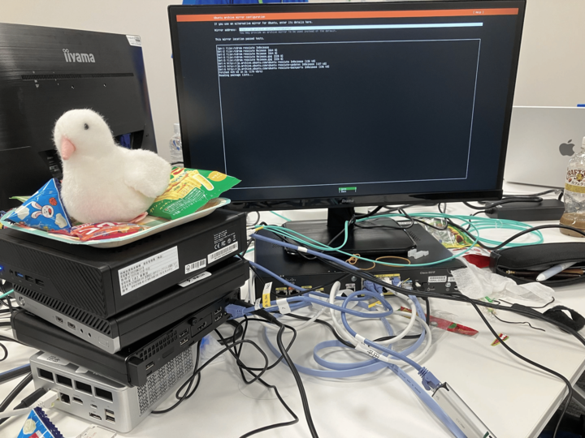
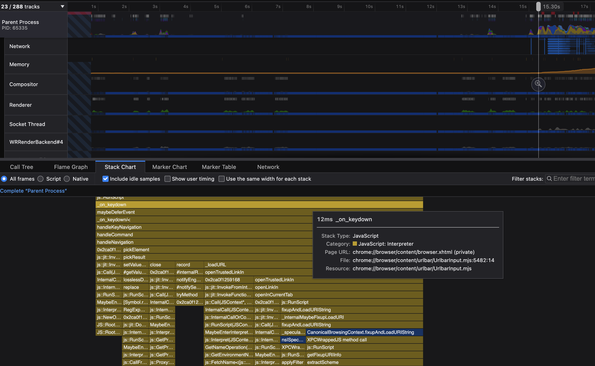

# ret2home's blog

## Recent Posts

  <a class="recent-post-card" href="others/seccamp2026/">
    
    
      <time datetime="2026-08-21">August 21, 2026</time>
      セキュリティキャンプ2026 CDN 自作ゼミ参加記
      「私は CDN を自作した」と堂々と主張する権利を得る方法
    
  </a>
  <a class="recent-post-card" href="others/seccamp2026_problem/">
    
    
      <time datetime="2026-06-05">June 5, 2026</time>
      セキュリティキャンプ2026 CDN 自作ゼミ応募課題
      URL入力からレンダリングまで、ブラウザとネットワークの処理を追う
    
  </a>

## About

情報系大学生をしています，[ret2home](https://x.com/ret2home) です．

中高生の頃は競プロや CTF を主にやっていました．現在はネットワーク・OS・コンピュータアーキテクチャに興味があります．

## Education

- 〜2024/03　筑波大学附属駒場高校
- 2024/04〜　東京大学教養学部理科一類
- 2026/04〜　東京大学理学部情報科学科

## Accounts

- Twitter : [ret2home](https://x.com/ret2home)
- AtCoder : [define](https://atcoder.jp/users/define)
- GitHub : [ret2home](https://github.com/ret2home)
- CTF : [ret2home](https://ctftime.org/team/166930)
- Qiita: [ret2home](https://qiita.com/ret2home)
- Linkedin: [ret2home](https://www.linkedin.com/in/ret2home/)
- hatenablog: [defineprogram](https://defineprogram.hatenablog.com/) ※当 blog に移植済

Contact: defineprogram at gmail.com
