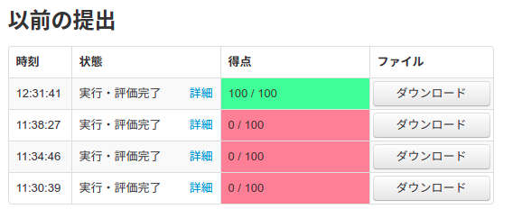

## TL; DR

300 点で本選落ち

| ID | SCORE |
|:---:|:---:|
| A | 100 |
| B | 100 |
| C | 100 |
| D | 0 |
| E | 0 |
| TOTAL | 300 |


## Day 1

### 午前

午前は内部生も高校入試を受ける事になっていたので、仕方なく受けた。

午後は公欠になっていたので 3 科目しか受けていないが、去年の合格最低点は 339 点らしいので合格したか不安で食事が鼻を通らない。

### 午後

15 時からの開会式では、いつも通り伊藤委員長が面白かった。流石は「よし、グラフだ！」の生みの親。

<blockquote class="twitter-tweet" data-theme="dark"><p lang="ja" dir="ltr">「よし，グラフだ！」は JCIOI 科学委員長の伊藤哲史先生の迷言です<a href="https://twitter.com/hashtag/JOIss2020?src=hash&amp;ref_src=twsrc%5Etfw">#JOIss2020</a> <a href="https://t.co/hjTE8ftIod">pic.twitter.com/hjTE8ftIod</a></p>&mdash; That’s きたむー (@Pro_ktmr_b0t) <a href="https://twitter.com/Pro_ktmr_b0t/status/1298992824700923911?ref_src=twsrc%5Etfw">August 27, 2020</a></blockquote> <script async src="https://platform.twitter.com/widgets.js" charset="utf-8"></script>

自己紹介は「**これを見た人に明日絶起する呪いを掛けました**」にした。まぁまぁウケていたようでヨシ（？）

プラクティスでは、標準入出力がかなり遅いのと、実行速度がちょっと遅いのを確認した。ちょっと不安...

プラクティス後は、Among us を ROM して割とすぐに寝た（22 時くらい）。眠りが深くなってくる 23 時頃、大きな揺れで目を覚ました。
ここまで大きい揺れはかなり久しぶりだったので、心底驚いた。

取り敢えず双子の安否を確認し、Discord を見ると震度 6 強の文字が。そして、競技が少なくとも 1 時間こどふぉる事が宣告された。

## Day 2

朝起きたら、書類が崩れていた。そういう事が、時々、ある（新海誠）

残念な事に無限人起きていて、絶起する呪いはこうかがなかったみたいだ... 闇討ち失敗

絶起したと思われた PCT も 1 分前に LINE で起こしてもらったらしく、めでたしめでたし

<blockquote class="twitter-tweet" data-theme="dark"><p lang="ja" dir="ltr">なにがあったかというとこういうことです <a href="https://t.co/0EvCuRWhQv">pic.twitter.com/0EvCuRWhQv</a></p>&mdash; PCT (@PCTprobability) <a href="https://twitter.com/PCTprobability/status/1360821831628824577?ref_src=twsrc%5Etfw">February 14, 2021</a></blockquote> <script async src="https://platform.twitter.com/widgets.js" charset="utf-8"></script>

適当にクソツイをして、競技開始。

### Start - 1:00

元々は 30 分で A, B まで解いてから 1 時間で C を解き、残りの時間で部分点を回収する予定だったのだが、A から難しい。

入試の帰りに anmichi が 「家庭菜園シリーズ出るんじゃね」と言っていたのがまさか当たるとは... #anmichi不正

差分を考えると両端以外不変だなぁというのはすぐに分かったが、区間の選び方が分からなかった。中心の左側と右側から 1 つずつ選んで、差分をマイナスするので、左側と右側でそれぞれソートして上から左右の MAX の和を取っていく事を考えた。が、これは $O(N^2 \\log \\ N)$ になり小課題 1 しか取れないだろう...

ごにょごにょ考えている内に 50 分が経過していた。

オーダーを減らす方法が分からなかったので、取り敢えず解法の確認がてら提出してみると ... 


> 出力は正しくない

えーーーーーー

なにも分からないので、取り敢えず B に進む事に。

### 1:00 - 2:00

問題を読むと、小課題 1 が座標圧縮してセグ木で殴れそうなので殴ってみると ...


> 実行時間超過

えーーーーーー

$4 \times 10^6$ に log 付けても流石に通ると思ってたら通らなかった。

そもそも座標圧縮の時点で TLE していたので救いようがない。これも諦めて C を読むが、流石に 2 時間経過時点で 0pts なのはヤバいので A に戻る事にした（英断）。

### 2:00 - 2:30

ここで、中心の右側に大きい差分が 1 つ、左側に小さい差分が 2 つあった時、左側 2 回で 右側 1 回を倒す事ができる事に気づく。

あれ、これは右側と左側それぞれの SUM の MAX が答えでは？これは中止を決め打ちして累積和で解ける。提出すると ...


開始 2 時間にしてようやく点を得た。やばいね！

<details>
<summary>コード</summary>

```cpp
#include "template/template.cpp"

ll N,A[1<<18];
ll L[1<<18],R[1<<18];
int main() {
    cin.tie(0); ios::sync_with_stdio(false);
    cin>>N;
    rep(i,N)cin>>A[i];
    vector<ll>st;
    ll cur=0;
    REP(i,N){
        cur+=(max(0ll,A[i-1]+1-A[i]));
        L[i]=cur;
    }
    cur=0;
    for(int i=N-2;i>=0;i--){
        cur+=(max(0ll,A[i+1]+1-A[i]));
        R[i]=cur;
    }
    ll ans=inf;
    rep(i,N)chmin(ans,max(L[i],R[i]));
    cout<<ans<<"\n";
}

```
</details>

そのまま B を見ると、雪玉がつくのはそれぞれ区間になっている事に気づく。一度左側で区間が重なると、左側に区間が伸びる事はない。
つまり、何回目で区間が重なるかが分かれば良い。重なっているかは単調性があるので、二分探索ができる。

前処理しておけばただの二分探索で済んだのだが、何を思ったか並行二分探索をした。

提出すると ... 



OK, OK

<details>
<summary>コード</summary>

```cpp
#include "template/template.cpp"

int N,Q;
ll X[1<<18],Y[1<<18];
int okl[1<<18],ngl[1<<18];
int okr[1<<18],ngr[1<<18];
ll mostl[1<<18],mostr[1<<18],mostcur[1<<18];

vector<int>judge[1<<18];
int main() {
    cin.tie(0); ios::sync_with_stdio(false);
    cin>>N>>Q;
    rep(i,N)cin>>X[i];
    ll cur=0,nowl=0,nowr=0;
    rep(i,Q){
        cin>>Y[i];
        cur+=Y[i];
        chmin(nowl,cur);chmax(nowr,cur);
        mostcur[i]=cur;
        mostl[i]=nowl;
        mostr[i]=nowr;
    }
    rep(i,N){
        ngl[i]=ngr[i]=Q;
        okl[i]=okr[i]=-1;
    }
    okl[0]=Q-1;okr[N-1]=Q-1;
    while(1){
        bool flag=false;
        rep(i,Q)judge[i].clear();
        REP(i,N){
            if(ngl[i]-okl[i]>1){
                flag=true;
                judge[(okl[i]+ngl[i])/2].push_back(i);
            }
        }
        if(!flag)break;
        ll l=0,r=0,cur=0;
        rep(i,Q){
            cur+=Y[i];
            chmin(l,cur);chmax(r,cur);
            for(int j:judge[i]){
                if(X[j-1]+r<=X[j]+l)okl[j]=i;
                else ngl[j]=i;
            }
        }
    }
    while(1){
        bool flag=false;
        rep(i,Q)judge[i].clear();
        rep(i,N-1){
            if(ngr[i]-okr[i]>1){
                flag=true;
                judge[(okr[i]+ngr[i])/2].push_back(i);
            }
        }
        if(!flag)break;
        ll l=0,r=0,cur=0;
        rep(i,Q){
            cur+=Y[i];
            chmin(l,cur);chmax(r,cur);
            for(int j:judge[i]){
                if(X[j]+r<=X[j+1]+l)okr[j]=i;
                else ngr[j]=i;
            }
        }
    }
    rep(i,N){
        ll ansl=X[i];
        if(okl[i]!=-1)ansl+=mostl[okl[i]];
        ll ansr=X[i];
        if(okr[i]!=-1)ansr+=mostr[okr[i]];
        if(okl[i]!=Q-1&&Y[okl[i]+1]<=0){
            ansl=X[i-1]+mostr[okl[i]+1];
        }
        if(okr[i]!=Q-1&&Y[okr[i]+1]>=0){
            ansr=X[i+1]+mostl[okr[i]+1];
        }
        cout<<ansr-ansl<<"\n";
    }
}
```
</details>

やっぱり最初の問題が解けてないと、不安ばかりがついて集中できないようだ。あとは、C を倒すだけ。

### 2:30 - 3:30

C を倒す前に、一応自明な部分点を取っておこうと思い D, E を開くがどれも難しかったので C を考える事にした。
問題の性質を観察すると、-1 までは許されるソートのようだ。

さらに観察すると、答えは $[4,3,2,1,5,8,7,6]$ のように順列を区間ごとにリバースした形になっている事が分かった。

つまり、遷移はスタートの index 毎にどこまで区間に含めるかで $O(N^2)$ くらいになるはずだ。

$i$ から $X$ まで区間に含める遷移が分かっている時、$X+1$ の遷移がどうなるかを考える。すると、 $X+1$ を一番前まで持ってくるコストが加算される。
なお、$i$ 未満は既に前に移動しているので、$X+1$ より後ろで $i$ 未満の個数分後ろにズレている事に注意だ。

しかし、$X$ 未満で $X+1$ を抜いた結果無駄になっているコストがある。これは、$X+1$ の元々あった場所より後ろにあって、既に遷移したものの個数となる。
これは BIT で効率的に計算できる。

よって、$O(N^2 \ log \ N)$ で間に合うはず。実装すると、一発で AC できた。


<details>
<summary>コード</summary>

```cpp
#include "template/template.cpp"
#include "structure/BIT.cpp"

int N;
int A[5005],loc[5005];
ll dp[5005];
int main() {
    cin.tie(0); ios::sync_with_stdio(false);
    cin>>N;
    rep(i,N){
        cin>>A[i];A[i]--;
        loc[A[i]]=i;
    }
    rep(i,N+1)dp[i]=inf;
    dp[0]=0;
    BIT<int>bit2(N);
    rep(i,N){
        BIT<int>bit(N);
        ll cos=0;
        for(int j=i;j<N;j++){
            cos+=max(0,loc[j]+bit2.sum(loc[j],N)-i);
            cos-=bit.sum(loc[j],N);
            chmin(dp[j+1],dp[i]+cos);
            bit.add(loc[j],1);
        }
        bit2.add(loc[i],1);
    }
    cout<<dp[N]<<"\n";
}
```
</details>

現時点で 300 点。 <span style="color : #FF0000;"> **ここで、勝利を確信する。**</span>

これが今回の最大の敗因と言って差し支えない。ちなみに、二番目は A に時間を掛けすぎた事だ。

D の 小課題 1 の解法がなんとなく思いついていたが、流石に 20 人も 3 完していないだろうと慢心を起こしたのだった。暖色が 30 人いるのをお忘れのようだ。

そのまま 30 分程ボーッとしている内に競技は終了した。

### 競技終了後

本選の得点表を眺めていたら、300 点が無限人いてたまげた。300 点超えは 16 人しかいなかったが、300 点 も 16 人いたのだ。

なんで部分点を取らなかったんだろう。なんで最後の 30 分ボーッとしていたんだろう。なんで　D の小課題 1 を実装しなかったんだろう。

今更悔いても仕方がないが。精神も壊れ、人間関係も壊れ、そして信用も失い、最終的には(ry

ちなみに、去年春合宿に参加した人で本選落ちした人は私含めて 4 人ないし 5 人いるようだ。
kaage が本選落ち春er三銃士の画像を作っていたので紹介する。煽りやすい人を集めたっぽい。


落ちた状態で交流会なんて出来る訳ないだろと思っていたが、交流は楽しかった。本選競技より遊んでいる時間の方が長かったかも知れない。

<hr>

まだ JOI は 2 回あるが、次回以降の教訓としては **取れる点は全て取れ** という点が挙げられる。来年こそは！