<a href="https://twitter.com/share?ref_src=twsrc%5Etfw" class="twitter-share-button" data-show-count="false">Tweet</a>

## 0. 超！概要

2/13 〜 2/16 に行われた Thailand International Science Fair 2023 (TISF 2023) に参加し、研究発表や文化交流などをしてきました。
この記事では、本イベントに参加する事になった経緯や前日譚、そして参加記を主に時系列順に綴ります。日本学生科学賞に関する話もちょっとします。なお、全部書くと相当な分量になるので、結構書く事は絞りました。また、顔が写っている写真は載せていません。

（余談） 
去年の秋から、小旅行も含めればもう旅行 6 回目です。ちなみに京都は京大、関西地域研究、マスフェスタで 3 回も行きました。ちなみに、小学生の頃そろばんの大会か何かで京都に 2 回行っているので、もう 5 回も行った計算になりますね。以上、あまりにも偏った旅行遍歴でした。

- (2021) 11/23　京都大学研究室訪問
- (2022) 05/03　灘校文化祭訪問
- (2022) 05/16 〜 05/20　関西地域研究
- (2022) 08/27 〜 08/28　マスフェスタ
- (2023) 01/03　熱海小旅行
- (2023) 02/11 〜 02/19　TISF2023

## 1. 9 月　参加申し込み

9 月末に学校から参加者募集のメールが届きました。要約すると以下の通りです。

- 2/13 〜 2/16 にタイで TISF 2023 が開催される
- 本校からの派遣は 1 チーム (1 〜 3 人)
- 高校入試と被っているため、オンラインの可能性が高い

まだ研究の方は上手く行っている訳ではありませんでしたが、海外に行った経験がなく憧れていたので、取り敢えず申し込む事にしました。申し込んでから取り下げる事だって出来る訳ですから、申し込んで損はありません。ただ、オンライン発表だけではつまらないので、実地で参加できるなら参加したい旨を強くアピールしました。

結局、家族が教員の代わりに引率する事を条件に、実地で参加できる事になりました。正直、ほぼ確実にオンラインだと思っていたので非常に嬉しかったです。

## 2. 10 〜 12 月　日本学生科学賞

### 2.1. エクストリームレポート生成

10 月は文化祭作業の傍らで、[日本学生科学賞](https://event.yomiuri.co.jp/jssa/) への出品に向けて研究を進めました。応募締切が 10/24(月) 必着だったんですが、本当に計画性が無さすぎてレポートを書き始めたのが 10/18(火)とかでした。本来は木曜日には郵送するはずだったんですが、どうしてこうなったんでしょうねぇ〜

結局、書き終わって指導教員の先生にレポートの添削をお願いしたのが金曜の夜でした。忙しい合間を縫って 1 日で返してくれた先生には本当に感謝しかないです。

修正、印刷を済ませ郵送の準備は整いましたが、土曜に送って月曜に着くためには速達で送る必要があり、かつ確実に送るには郵便局に行かないといけません。しかし、土曜は郵便局が閉まるのが早いのです。一番近い郵便局は渋谷郵便局でしたから、渋谷の雑踏を死ぬ気で抜ける必要がありました。それはもう、メロスになった気持ちで死ぬ気で走りました。

... しかし、3 分間に合いませんでした。あぁ哀れなセリヌンティウスよ。しかも、バッグに訳の分からないホストのチラシが 3 枚も入れられていたのです。メロスは激怒した。

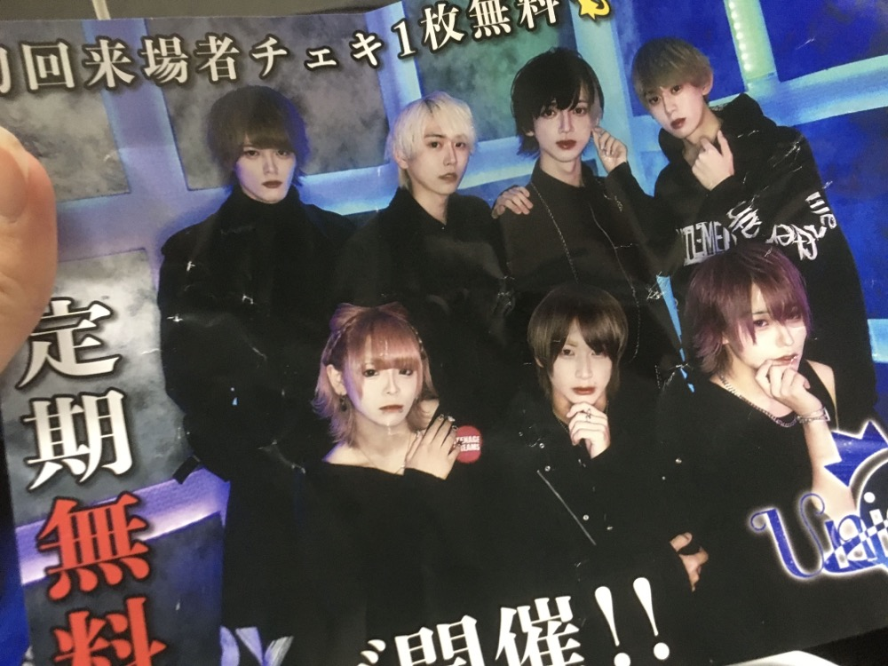{width=250px}

しょうがないので、日曜日の朝に速達簡易書留で郵送してなんとか間に合いました。

### 2.2. 最終審査

さて、私は応用数学部門で出品しましたが、この部門は事前審査→中央予備審査→中央最終審査と進んでいきます。11 月中旬に中央予備審査突破のメールが届き、いよいよ大詰めに入りました。学生科学賞は応募総数が 7 万件程ありますが、最終審査まで進めるのは 40 作品のみという事で、この時点でもかなり嬉しかったです。

予備審査まではレポートの書面審査でしたが、最終審査ではプレゼン審査があります。しかし、このプレゼン動画の時間制限が 5 分とかいう目を疑うような設定だったのが一番大変でした。

とはいえ、最終審査と日程が被っていたおかげで、精神を最大限疲弊する事で知られる某「クリスマス模試」(高 3 の 1 年間のクラスが決まる試験)に参加しないで済んだのは割と大きかったです。後輩の皆さんも、クリ模試を受けたくない場合は学生科学賞に申し込むと良いと思います、知らんけど。ちなみに受けないと下位クラスの通知が一旦来ますが、普通に救済措置はあるので安心してください。

結果に関しては、色々あって主催者賞である読売新聞社賞を受賞する事ができました。
これで国際大会に参加する体裁は整ったというものです。

{width=350px}

一方、TISF の Oral Presentation には選ばれていませんでした。Abstract のみの審査だったので、研究の本質パートである解法の部分が伝わらなかったんだろうと思います。ちょっと残念です。

## 3. 2/11　出国

搭乗時刻が 23:55 という深夜便だったので、夕方に羽田まで向かいました。人手不足と噂には聞いていましたが、保安検査場が酷い混雑でした。私はそのまま抜けられましたが、弟はハサミ所持容疑で簡易事情聴取(?)の上没収されていました...。

人生初のパスポートスタンプをもらって、いよいよ出発です。飛行機が浮いた時、もう絶対に引き返せないという実感が湧いたのを鮮明に覚えています。

~~東京よさらば！　我が代表堂々出国す~~

{width=350px}

ちなみに、機内食はこんな感じでした。非常に日本らしいですね。牧場の朝ヨーグルトくんは気圧でパンパンです。

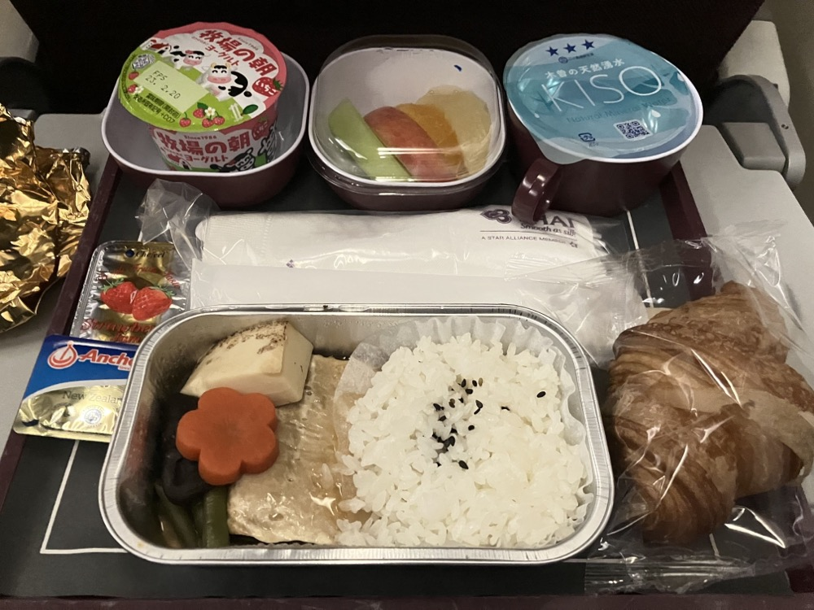{width=315px} 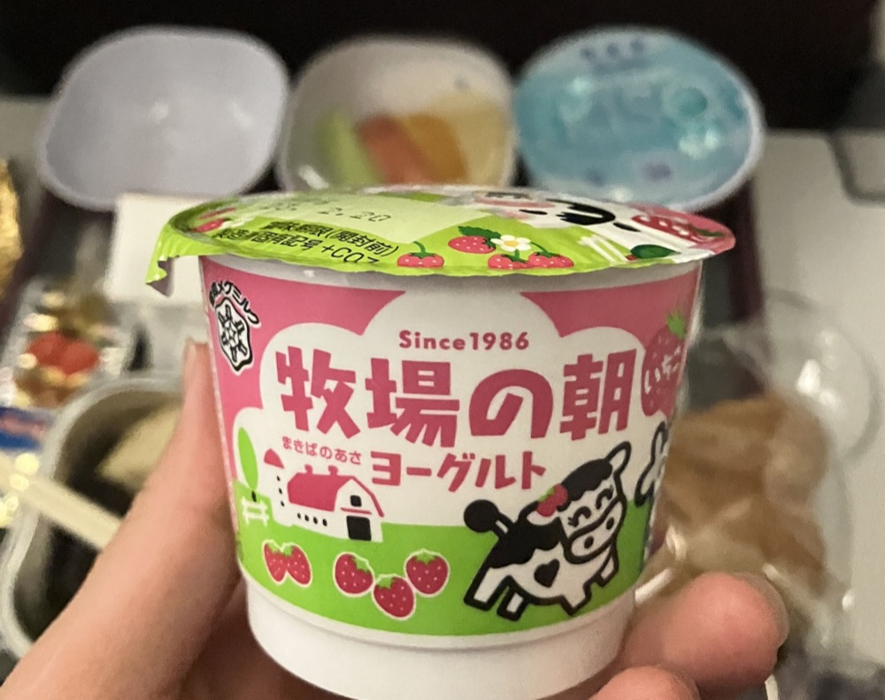{width=300px}

## 4. 2/12　到着

羽田を 0 時に出発して、5 時くらいにバンコクのスワンナプーム国際空港に到着しました。時差も考慮すると 7 時間くらい掛かった感じです。
入国審査をパスした後待ち合わせ場所に向かいましたが、ローソンはあるし、上についてる時計も SEIKO だしで何となく外国に来た感が薄い...。

{width=350px}

待ち合わせ場所からは、車で開催校である Mahidol Wittayanusorn School まで連れて行ってくれ、Welcome Drinkが振る舞われました。
ココナッツミルクに果肉のゼリー？のようなものが入っていて、甘くて美味しかったです。

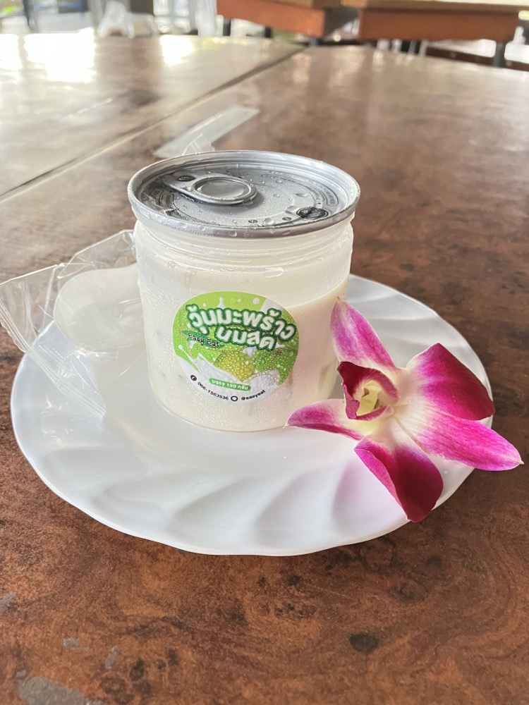{width=350px}

ここで家族とはお別れ。あとは一人で行動しないといけません。そして、ついに気づきます。

**冷静に考えて、初めての異国の地に一人で乗り込むって結構頭おかしくない？**

はい、おかしいですよね。一人ディズニー勢もびっくりだと思います。他の日本チームの人もいますが、到着は私よりずっと遅いので、暫くは一人で何とかする必要がありました。

とは言え、全体を通して面倒を見てくれるバディ(現地学校の生徒さん)がいたので心強かったです。学校案内をしてくれたり、ココナッツの葉での工作や花のネックレス作りなど、色々なアクティビティに参加させてくれたりしました。葉の工作の方は難しかったですが、折り紙みたいで楽しかったです。

とても気に入ったので、寮の机に飾っておきました。

{width=300px} 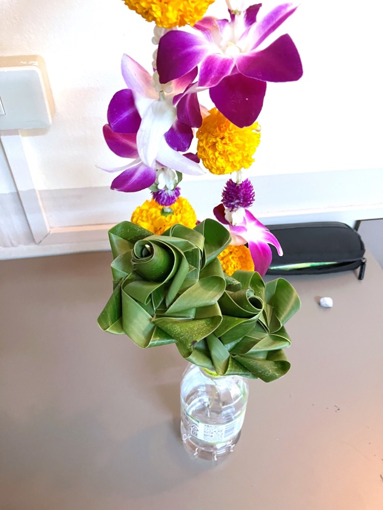{width=300px}

ポスターのセットアップなどをした後、疲れてしまったので早めにベッドにつきました。

（余談） 
折角なので、ご飯の話をちょっとしようと思います。本イベントでは、カフェテリアや購買で使えるクーポンが事前に配られ、それを使って各自で食事を取るという形でした。カフェテリアにはドリンクコーナー、タイ料理のコーナー、日本食のコーナーなどが並んでおり、食事は大体 30 〜 40 バーツ、飲み物は 20 バーツくらいしました。1 バーツが 4.5 円くらいなので、せいぜい一食 250 円程度と考えるととても安いです。

食べ物は基本的に辛いか、甘いかの両極端が多かったように思います。私は全然タイ米に慣れなかったのが大変でしたが、一方飲み物は果物をその場でジュースにしてくれるのが嬉しかったです。普通に飲料水を用意するよりも、果物から取った方が手っ取り早いのかも知れません。

また、これは結構驚いた事ですが、タイの人は（少なくともそこの生徒さんは）食事を残すのにあまり抵抗がないようです。これが食料自給率の差なんでしょうか...？

## 5. 2/13　Day 1

### 5.1. 開会式

朝食をとった後、シリントーン王女殿下をお招きした開会式に参加しました。流石はタイ王室、軍隊が厳重な警備を敷いていました。学生科学賞表彰式の時は秋篠宮殿下が出席されていましたが、これに比べると警備だいぶ緩かった気がします。あれ？

あと、異様に待ち時間が長かったので、立命生とどんな研究をしていたのか話したりしていました。花の色の変化と pH の関係についての研究だそうで、そういえば幼稚園の頃、朝顔絞って色水で遊んでたなぁ、などと思い出しながら聞いていました（小学生並みの感想）。プロトプラストもアントシアニンも知らなかったので、良い勉強になりました。

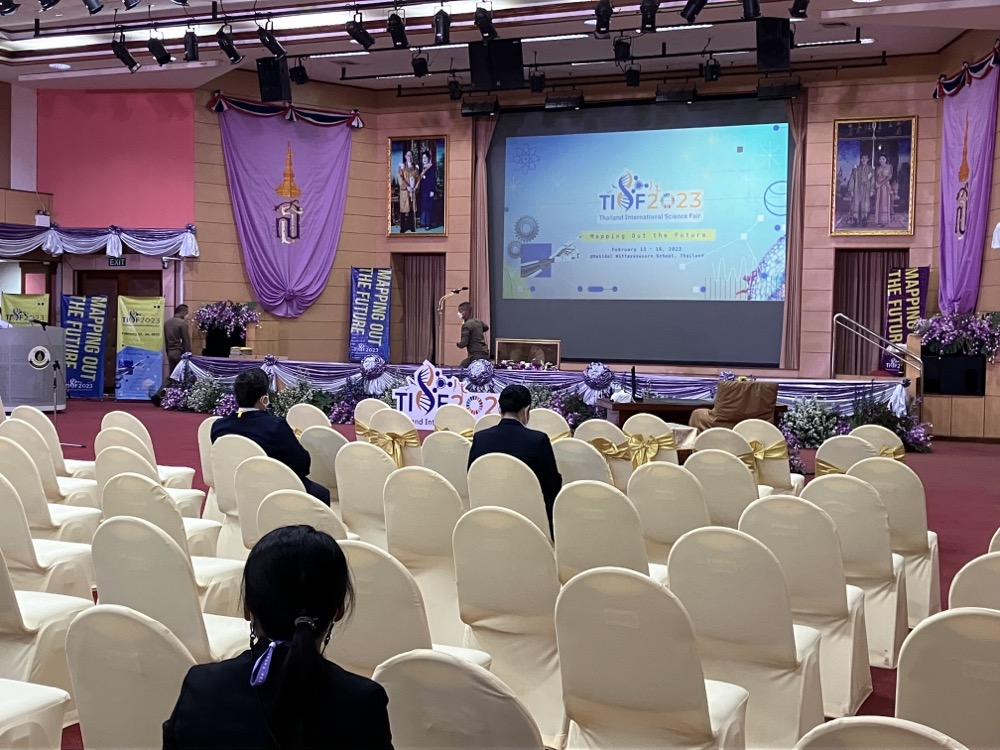{width=350px}

(始まった後は撮影禁止だったのであまり人がいない)

偉い人がスピーチをしていた記憶があるんですが、長過ぎて眠ってしまいました。ただ、選出された 3 つのプロジェクトの発表は面白かったです。特に、抗原検査と PCR 検査のいいとこ取りをした検査方法を開発した、とする発表には驚かされました。本当だったら今すぐにでも商用化できそう。

### 5.2. ポスター発表

Day1 にしてイベントの本質。台本も用意して、先生にも添削してもらって準備万端...のつもりでしたが、最初の発表の途中で気づいた事がありました。これは伝わらないな、という事です。研究の動機を話してから、問題の定式化を行い、議論を行うという流れのつもりでしたが、そもそも定式化の時点で伝わる気がしませんでした。

そこで、それ以降は難しい話を遠ざけ、割当問題が実生活においてどう活用できるか、という話に重点を置いた発表に切り替えました。ほとんど数式を用いない話で、しかも身近な話でしたから、反応は良くなりました。しかし、私の研究は割当問題の「拡張」についてであり、短時間で分かりやすく解説するために研究の核心に触れる事ができなかったのは残念でした。資料とかも色々用意したんだけどな〜。専門家とか回ってコメントしてくれるのかなと思いましたが、そんな事もありませんでした。あれー？？？

他のグループの研究も色々と見ましたが、情報科学の分野に関して言えば、物体検出ライブラリ YOLO を使ったものが本当に多かったです。私自身、偉そうな事を言える立場にはありませんが、個人的な意見を表明すると、この類のものは最初から出来る事が分かっている以上いかがなものかと思います。しかも、知識がない人から見れば確かに YOLO が優秀なおかげでそれっぽいのです。彼らがわざとやっている訳ではないと思いますが、最近話題の「AI絵師」と同じような問題が起きている気がしてなりません。

余談ですが、タイ高専なるものがあるらしく、そこの学校の人は日本語を割と喋れるようでした。三カ国語喋れるって本当に凄い...。
他にも、ジャニーズ好きが高じて日本語が喋れるようになった人とかもいました。私もホロライブ EN で勉強しようかな？

### 5.3. Welcome Dinner

広場のような場所で、立命生のみんなとパフォーマンスを見ながら夕食をいただきました。他のイベントも含めて全体的に、基本的に立命勢に混ざって行動する事が多かったように思います。ぼっちだったら悲惨だったと思うので、本当に感謝ですね。

料理にも皿にも、本当によくココナッツが使われていたのが印象的でした。スイーツにも必ずと言っていいほどココナッツが使われていました。日本で言うあんこみたいなものなんでしょうか？

タイ料理も良かったですが、一番美味しかったのはフライドチキンでした（最悪）。どうでもいいですが、熱心な仏教国なはずなのにタイの人がパフォーマンスでハレルヤハレルヤ歌ってて面白かったです。

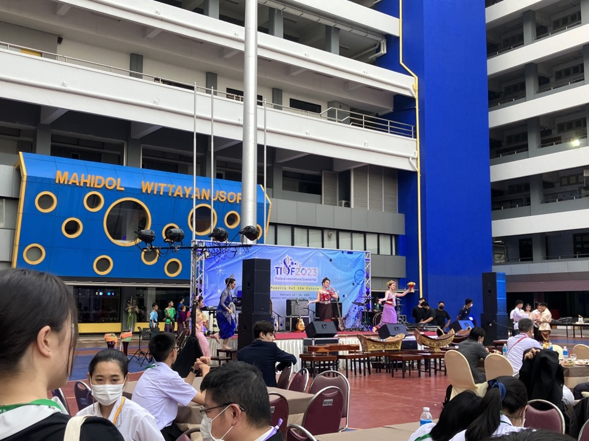{width=450px}

## 6. 2/14　Day2

### 6.1. Oral Presentation

前述の通り、残念ながら私は選ばれませんでしたが、早稲田本庄さんが選出されていたので、それを聞いたりしていました。個人的に一番興味深かったのは中国チームの壁を登るロボットで、凄くダイナミックな動きをしていました。

私も多少質問をしてみたんですが、癖がある英語だったからか、私のリスニング能力のせいか、なんて回答されたか分からなかったのは残念でした。

### 6.2. Science Activities

私は生物のグループになり、探偵ごっこ的な事をしました。具体的に言うと、殺人事件の事件現場に残された足跡から身長を割り出したり、証言を解析したりして犯人を特定する課題です。

生物要素は意外と少なかったんですが、情報量がエグ過ぎて大変でした。普通にそこら辺の読解問題よりキツかったです笑

あと、グループワークだったので意思疎通もちょっと苦労しました。真面目に英語を勉強しとくんだったと思うにはあまりに遅いですね。帰国後は心を入れ替えてちゃんと勉強しています。...とはならないんだな、これが。

余談ですが、同じグループにいた日本語も絵も上手いカンボジアチームの人がいて面白かったです。

{width=350px}

ちなみに、他のグループには数学、物理などがあり、物理では楽器作りをしていたそうです。楽しそ〜

### 6.3. Game Night

クイズ大会とかタイの遊びとかを色々やりました。マシュマロとスパゲッティで高い塔を作るのが一番楽しそうでしたが、時間がなくてできませんでした。似た競技としてアイス棒タワーコンテストが有名ですが、建築学科の猛者が集まって凄いらしいですね。

ここら辺で多少の社交性を身に付け（？）、韓国チームの人とロシアチームの人とちょっと仲良くなれました。

交流の時、海外だと基本的に Instagram を交換する感じだったので 12 月に始めておいて本当に良かったと思いました。と言うか、本当に会話する度に交換してたので、FF が 1 週間で 2 倍くらいになった気がします。日本だと割と Twitter を交換する事が多かったので、意外な感じでした。でも他の日本チームの皆さんは Twitter やってなさそうな感じがしたので、私の周りだけかも知れません。

## 7. 2/15　Day 3

Day3 は終日 Science Zone という事で、バスで Thailand National Science and Technology Development Agency (タイ国立科学技術開発庁) まで遠出をしました。私のグループは LANTA というスパコンを見に行ったのと、先端的なデンプン技術の実験授業に参加しました。ただでさえ生物履修してないのに英語の専門用語で解説されるので結構滅入ってしまいましたが、実験も多かったので助かりました。ちなみに、立命の方は普通の授業も英語で受けるコースがあるらしく、こういうのも慣れていそうで羨ましかったです。個人的には、白衣姿が様になっているのが印象的でした（そこ？）

そういえば、私自身白い白衣を着たのも久しぶりだった気がします。うちの学校、文化祭のペンキ作業で服が汚れないように白衣を着る慣習があるので、大体白衣がカラフルだったりするんですよね。

京都大学のスパコンを見に行った時は空冷のファンの音が本当に凄かったので覚悟していたんですが、LANTA は水で冷却しているそうで、普通に静かで意外でした。あと、ASEAN で一番速いらしいです。また、京大のスパコン室の入り口には雷避けのお札が色々あったんですが、こっちは特に宗教的なものはありませんでした笑

{width=400px}

何かと休み時間が多かったので、交流もできました。ジブリ、君の名は、天気の子、SPYxFAMILY、などなど思っている以上に日本のアニメを観ている人が多かったので、一通り分かるのは良かったと思います。東京喰種、呪術廻戦、鬼滅あたりの話になる事も多かったので、そこら辺も観ておけば良かったな、と思うくらいです！

ちなみに、歌の方では、藤井風さんの「死ぬのがいいわ」が一番人気だそうです。私はたまに Spotify のミックスリストで流れてくるくらいの認識だったのでちょっと意外でした。

（余談） 
日本チームの参加者全員が発表をする訳ではない事は知っていましたが、発表をしていても研究に関わっている訳ではないと言う話を聞いて、本当に驚きました。
実際に研究をして発表をしていたのは私と立命勢の合わせて 3 人だけだったようです。お二方には真摯な姿勢に心から敬意を表したいと思います。

## 8. 2/16　Day 4

### 8.1. Cultural Excursions

最終日という事で王宮などバンコクの観光に出掛けました。

まずは王宮。エメラルド寺院と王宮とで隣接している割に、前者はいかにも東南アジア風にもかかわらず、後者は西洋を感じさせる造りになっていて興味深かったです。屋根の辺りはともかく、1 階とかアナ雪で出て来てもおかしくない感じがしませんか？こっちは暑いけど！

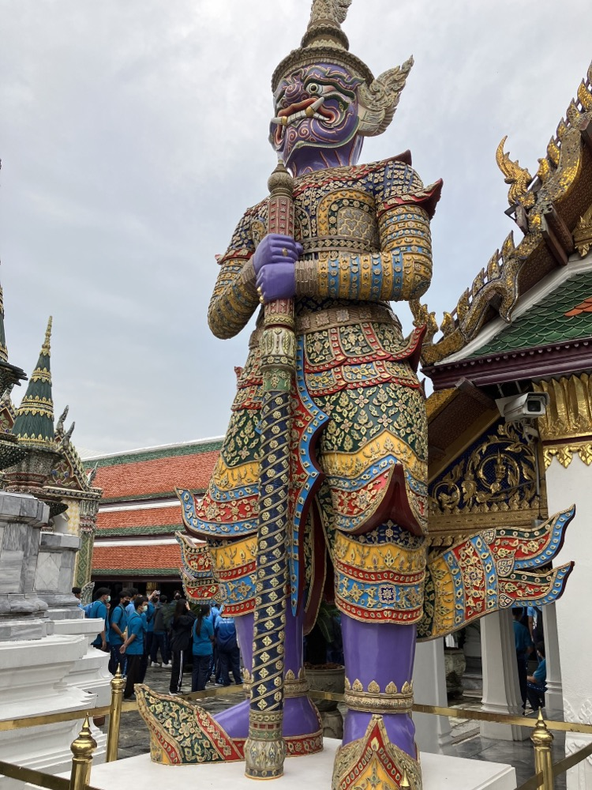{width=300px}
{width=450px}

王宮の次は、国立博物館に向かいました。お神輿にしか見えない王様の椅子（？）とか、儀式をやると銃弾が通らなくなるらしい象（？）とか色々展示してあって面白かったです。国立博物館と言う割には、意外と小さかった気がします。

{width=300px} 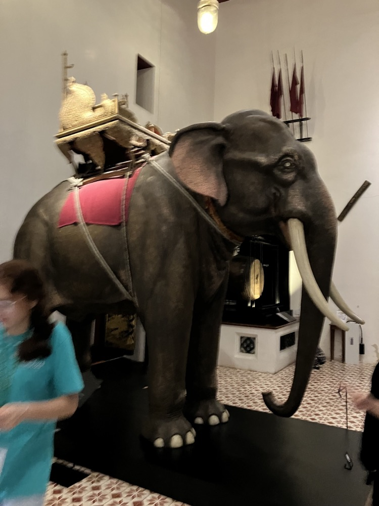{width=300px}

国立博物館の次は、最後に ICONSIAM というショッピングモールに向かいました。ずっとイコンシアムと読んでいましたが、アイコンサイアムだそうです。言われてみればそれはそうですね。~~英弱がバレる~~

ICONSIAM は 1 階は屋台が並んだいわゆる「デパ地下」、2 階からは日本の百貨店のような高級感溢れる感じでした。1 階はかなりカオスを感じる所がありますが、上から眺めてみると、意外と統率の取られた「意図的なカオス」とも言える空間設計のようにも思えます。

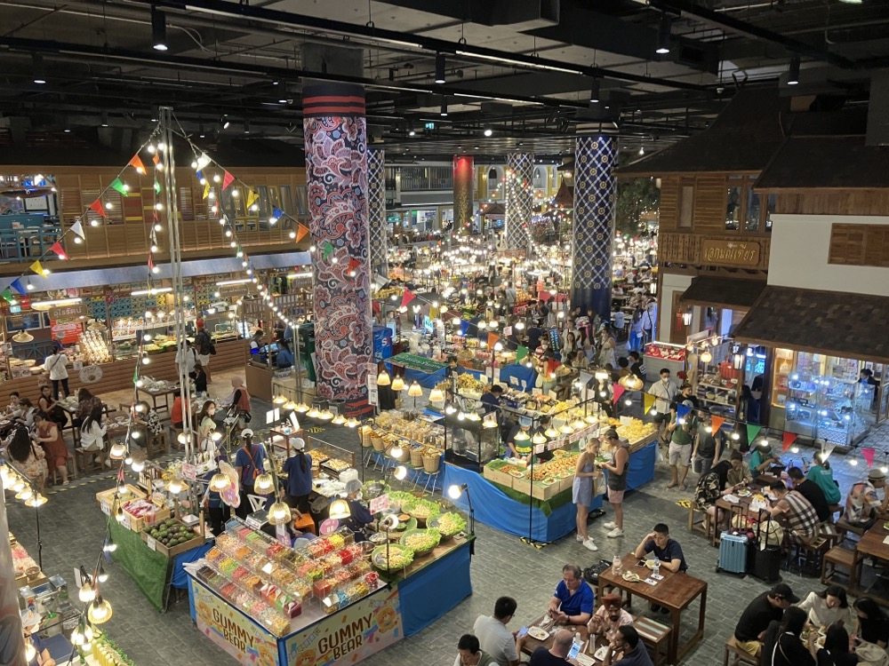{width=500px} {width=300px}

さて、タイに来てからまだトムヤムクンを食べていなかったので、昼食はそれを食べる事にしました。

{width=400px} 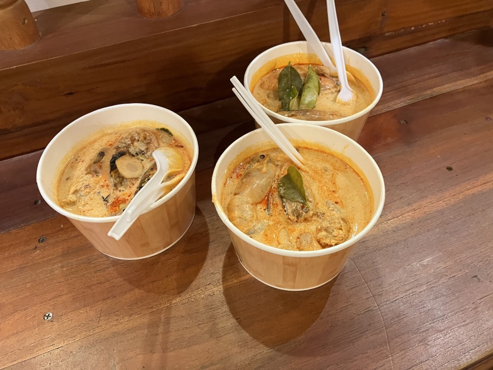{width=300px}

観光客向けだったのか、そんなに辛くはなかったです。トマトの酸味が絶妙で美味しかったですが、エビが丸々入っていたのでちょっと大変でした。

その後はお土産を買ったり、スタバ的な場所で飲み物を買って飲んだりしてゆっくり過ごしました。これは解せないんですが、タイでは緑茶にハチミツを入れる事が多いらしいんですよね。なので普通の「お〜いお茶」とかには敢えて "Unsweetened Tea" と書かれていたりします。

{width=400px}

また、1 階半みたいな場所があったので登ってみたらタイ式マッサージ店があり、5 分無料！としきりに勧めてくるので「あ、これぼったくられるやつや...」と思いましたが、敢えて受けてみる事にしました。トンカチみたいなのでひたすら肩とか叩かれるんですね、あれ。私は結構痛かったんですが、一緒に受けてた早稲田の子は普通に気持ちよかったって言ってました。マジか。

結局、普通に 5 分で終わって無料だった上、写真まで撮ってくれました。疑ってすみませんでした〜

### 8.2. Farewell Party

余ったクーポンを全て消化するべく購買でお菓子を爆買いした後、Farewell Party に向かいました。あっという間に TISF も終わりです。

Farewell Party で日本チームは早稲田本庄生が J-pop&アニソンメドレー、立命&筑駒でソーラン節を踊りました。Day2 辺りから練習を重ねていましたが、私が相当下手だったのでご迷惑をお掛けしました。それでも嫌な顔せずに練習に付き合ってくれた立命の皆は本当に良い人たちだと思いましたし、それに応えるべく私なりの全力を尽くしました。上手く出来たかは分かりませんが、ダンス好きな同級生が上がってる動画を見てくれたらしく、褒めてくれたのは安心できたと言うか、本当に嬉しかったです。機材トラブルも起きましたが、観客のみんなのノリが良くて盛り上がったのは最高でした！！

アニソンメドレーの方が先だったので観ていましたが、夜に駆けるのイントロとか鳥肌立つレベルでダンスがキレッキレでカッコ良かったです。
他の国のパフォーマンスも最高でしたね、特に韓国チームの K-pop ダンスとか。文化祭の中夜祭を思い出すようでした。

また、皆さんのテンションも文化祭よろしくぶっ壊れてて、それはもう大量に写真を撮りました。他の人のスマホで撮ったツーショットも色々 Instagram に流れてて、それまで私は顔を載せない主義だったんですがもう諦めましたね笑

そして、パーティーが終わるともういよいよ、お別れの時間です。立命館で開かれる JSSF に参加できれば、日本チームとはまた会う機会がありますが、当分は先な上、運が悪ければ...。そう思うと非常に辛かったですし、そう思わせてくれるような素敵なメンバーでした。また JSSF で会える事を切に願っています。（それまで連絡が続くよう努めているつもりですが、煙たがられていない事を願うばかり！）

## 9. 2/17　Departure Day

私は早めに出て、家族と合流しましたが、他の日本チームはタイ語教室、アート教室などのアクティビティに参加していたそうで羨ましかったです。

合流した後は、USJ の JAWS みたいな船に乗ってバンコクを観光しました。

（余談） 
他の移動手段としてタクシーを使う事が何回かありましたが、漏れなくぼったくって来て最悪でした。過去に口論になって殺された事案もあるらしいので、金で解決できるものは金で解決しよう、の精神で払いましたが。

タクシーだけじゃなく、飲食店もぼったくってきたんですよね。すき焼き店で飲み物を頼んだら、伝えられてないのに飲み放題になっててあり得ない金額になってたりとか。何も信じられません。

ガイドさんと一緒に回ったんですが、前の王様の幼少期の顔に似ていると言われました。褒めているつもりなんだと思いますが、喜んでいいのかよくわかりません笑

帰りの飛行機でも CA さんにタイ語で話しかけられたんですが、そんなにタイ人っぽいんですかね...

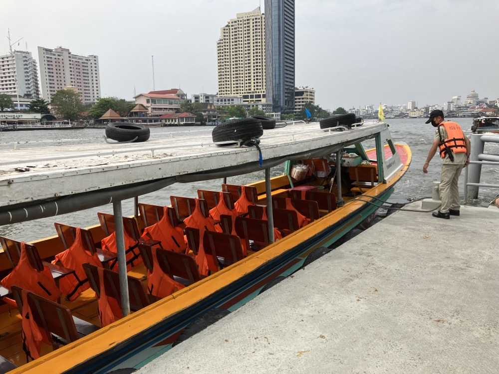{width=450px}

泊まったホテルは屋上にプールがあって、景色が最高でした。水着持ってくれば良かったな〜なんて。
あと、ホテルに「麻薬吸ったら罰金 5000 バーツ！」って書いてあって知ったんですが、最近タイで麻薬が合法化されたそうです。治安さん...

{width=450px}

夕食はホテルでマッシュルームとソーセージのスパゲッティを食べました。見た目以上に量があったのでちょっと大変でしたが、チーズが濃厚で美味しかったです。

{width=450px}

## 10. 2/18,19　帰国

18 日の夜に出発の便の予定だったので、それまでは基本的にホテルでゆっくり過ごしつつ、テストが近かったので数Ⅲの問題集をちまちまとやっていたりしました（結局 1A2B がほとんどだったので役に立たなかった）。立命生も期末が近かったそうで、寮で勉強していた記憶があります。

また、Instagram に上げた写真が学校で話題になっていたそうで、友達から色々連絡が来て嬉しかったのもこの頃です。

昼食はフカヒレスープを食べに行きました。丸々食べたのは初めてだったんですが、家系ラーメンのスープみたいな味がしました。私の味覚が壊れているんでしょうか？？？

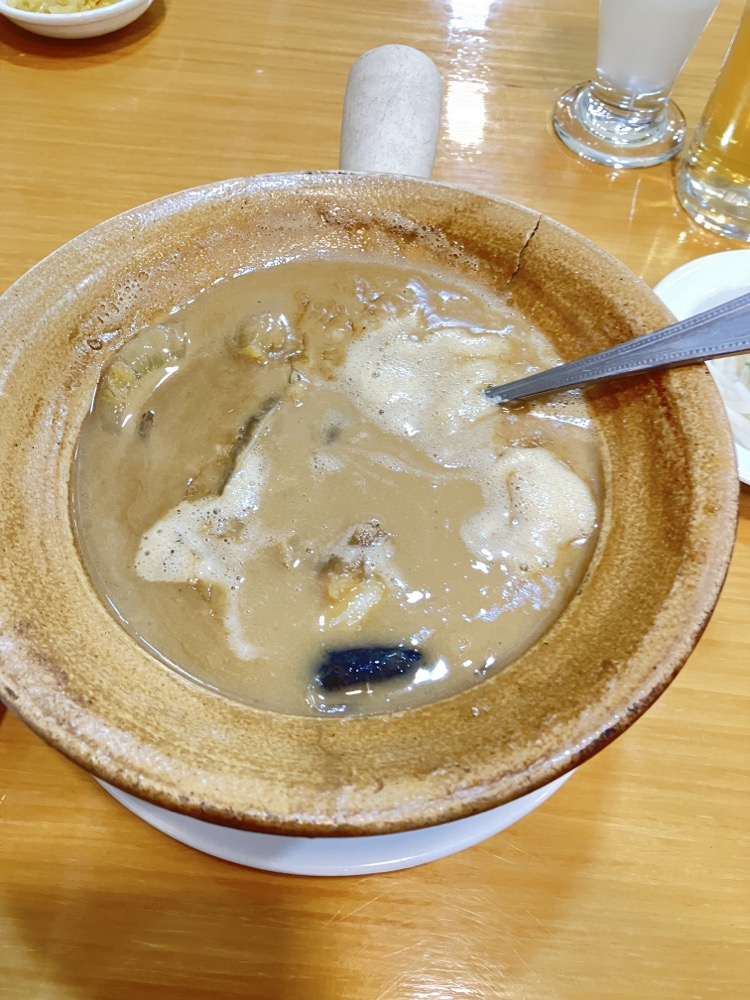{width=400px}

そんなこんなで夜になり、出国手続きをして、飛行機に乗り込みました。夜の便だったので、本当に星と朝焼けが綺麗で最高でした。

{width=400px}

ところで、機内食として配られたサンドウィッチが食べ切れなかったので、バッグに入れて持ち帰ろうとしたら羽田で検疫探知犬に一瞬で捕まりました。小さくて可愛らしいのになんて優秀なんでしょう！

おまけに警告文までもらいました。

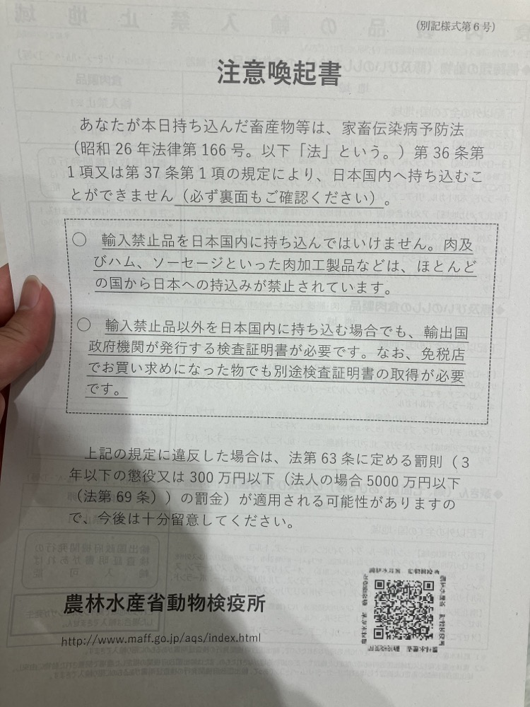{width=400px}

皆さんも飛行機に乗る時は気をつけてくださいね！

## 11. ひとこと

いかがでしたでしょうか？感想など教えてくれると嬉しいです！！ :)

最後に、貴重な機会を与えてくださった TISF 2023 Organizer、指導教員&国際交流担当教員をはじめとした本校の先生方、また、暖かく受け入れてくれた日本チームの皆さん、現地でお世話になったバディ、などなど本イベントに関わった全ての人に感謝を表して締めくくりたいと思います。