<a href="https://twitter.com/share?ref_src=twsrc%5Etfw" class="twitter-share-button" data-show-count="false">Tweet</a><script async src="https://platform.twitter.com/widgets.js" charset="utf-8"></script>

8/27〜8/28 に SSH（スーパーサイエンスハイスクール）事業の一環である「マスフェスタ」に参加するついでに 1 泊 2 日で小旅行をしてきました。

前半は主にマスフェスタの愚痴を、後半では主に旅行中に遭遇した面白い出来事を綴ります。

## 1. 6 月

本校は課題研究という授業（？）が必修で私は数学を取ってるんですが、夏休みに大阪でやる発表会の参加者を募集していました。

交通費が出るそうで、他人の金でする旅行より楽しいものはないだろ！って事で即立候補しました（最悪）。結構立候補者多そうと思ったんですが意外といないものなんですね。
ということで、私の他の発表者が T 君、見学者が H 君で 3 人で参加する事になりました（なお頭文字は Twitter の ID の頭文字）

決まってから気づいたんですが、去年の 11 月の京都大学訪問に 5 月の灘校文化祭訪問と関西地域研究を合わせて、1 年間で 4 回も関西に行っている事になります。
ちなみに他の地域は 0。個人的に北海道に行きたい気分だったのでそっちで発表会をやってほしかったです。

## 2. 7 月

発表要旨を 7 月末まで送れよ〜と言われてたなぁなどと思いつつ放置していたら、いつの間にか期限 (7/29) を過ぎていて催促されました。社会性 -10000

そこで、情報科学の達人で培われた「督促されてから短時間で発表要旨/ポスターを書く力」を発揮して、爆速で適当にそれっぽいのを生成したら先生にすごく褒められて驚きました。
皆さんも達人に参加すると良いと思います。

ちなみに要旨はこんな感じでした。うーん、適当！w

{width=450px}

ちなみにこの要旨は大手前高校の HP 上に公開されているので良かったら他のも見てみてください。https://otemae-hs.ed.jp/ssh/dat/2022mathfesta_abstract.pdf

ところで、社会性の高い T 君はもっと早く提出していたらしいんですが、公開されてから見てみたら意外と適当で驚きました。こんなんでええんか。ちなみにポイントは参考文献が教科書になってる所らしいです。

でもやってる事はかなり高度で、多分彼以外には不可能だと思います。

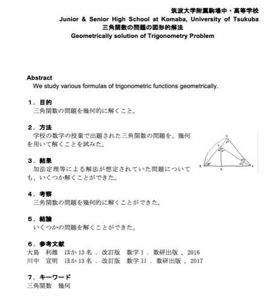{width=450px}

## 3. 〜 8 月中旬

3 人で発表の後に宿泊して観光しようとは決めていたんですが、それ以外に何も決まっていなかったので校内模試の後に全員集まってどこに行くか井戸端会議をしました（こういうのって意外と決まらないもので、立ち話で長々 1 時間くらい）。

結局、皆さんご予定があるそうで 1 泊のみで、嵐山の保津川下りと USJ に行こうという事になりました。ちなみに両方関西地域研究では行ってはいけなかった所です（先生曰く川下りは禁止していないが、水まわりは先生がつかないといけないので実質）。

やっぱ禁止されてるとワクワクしますよね！しかも、子供だけで宿泊（部活の合宿はともかく）も、川下りも USJ も人生で初です。これは興奮せずにはいられませんでした。

## 4. 〜 発表前

予定も決まったところで、ホテルの予約をしたり、未成年 only だったので一応ホテルに電話をして同意書を書く必要を確認したりと事務作業をこなしたところで、T 君が諸事情で参加できなくなってしまったので連絡したら、ご厚意で元の金額の 2/3 で良いという事になりました。キャンセル料を覚悟していたのでマジでありがたかったです。

ちなみに、T 君の発表内容はもうできていたので H 君が代わりに発表する事になりました。彼もめちゃくちゃ数学できるんですが、T 君があまりにぶっ飛んでるので彼の思考が理解できるのか正直心配ではありました。ポスターに「容易に図形的解法で解けた（絶対に思いつけない）」とか書くあたりそういう事です。

<br/>

また、24 日には 8 月末で移転する「チームラボボーダレス」に行ってきました。HP 上で見た通りエモエモだったのはもちろん、写真で見ただけでは分からない空間の広がりを体感できてとても楽しかったです（普通に歩くの大変なくらい）。鏡の使い方がうま過ぎるんですよね。筑駒でもやると良いのではないかと思われます。

{width=450px}

歩いてるとどれが鏡か本当にわかりません。ちなみに撮影してる私が鏡に映っているので頑張って探してみてください（解像度はクソですがスマホを向けているのはわかると思います）。一応最終日の夜のチケットが僅かに残っているそうなので、まだ行ってない人は是非！

<br>

帰って寝て起きたら、いつの間にか発表 2 日前になってたのでスライドの生成を始めました。

まぁいつもの事ですが、タイトルの背景を何にするかで結構時間を使うものです。結局このフリー素材を少し暗くして見やすくしたものを選びました。
研究テーマがマッチングなのでグラフを表現した画像にしたんですが、そこそこそれっぽくて良かったです（ちなみに会場のプロジェクターだと解像度が悪く星座にしか見えなかった）。

{width=450px}

学校を代表しているわけだから、自己紹介のついでに学校紹介もするか、という事で謎ページを作ってツイートしたら意外と fav がついたので、多分会場でやってもそこそこウケてくれるかなと安心しました。本当は以前カモがいた時の写真も入れようと思っていたんですが、探してもなくて残念。

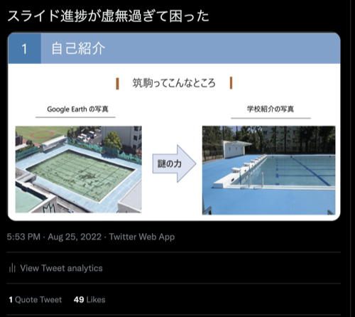{width=450px}

という事で、スライド作成やら発表やらはもう飽きるほどやってきたので、いつも通り双子のスライドデザインを ~~パクって~~ 参考にして爆速でスライドを作っていきました。ところで、個人的なスライド作成のポイントなんですが、アニメーションは極力使わず、ページを分けるようにすると後で PDF を公開する時に何をやっているのか分かりやすくなります。

ところで、一応研究対象の問題の解法は分かっていたつもりだったんですが、スライドの図を生成する時によくよく考えると間違っている事が発覚して急いで修正しました（反例も見つかった）。
こっちもワンチャン間違ってる可能性があったので愚直アルゴリズムでランダムチェッカーを回して、合ってる事が分かったので安心しました。
後は適当に喋る内容の大枠をスピーカーノートに書いて、完璧です。

<br/>

運営から発表時間を言われてなかったのでメールで聞いたら、発表時間は 45 分だけど 15 分くらいで発表してねとか訳わかんない事を言われました。なんだそれ。
質疑応答で議論を深めるとか言ってたので多分それなんだと思いますが、発表内容の難易度と量的に 15 分は厳しそうだったのでそれは諦めました。

ついでに要旨が公開されたので見たら、発表は教室でグループ毎に決まった時間にやるそうで、発表する知り合いが Y さんだけだったので見たらグループが被ってて残念でした。まぁ彼女はポスター発表らしいのでスライド発表と違って内容は見れる訳ですが。

<br/>

そんなこんなで発表準備が整ったものの、丁度昼夜逆転してしまっていたので全く眠れず、結局ほぼ徹夜のような形で発表で挑むことになってしまいました。
とは言っても、去年の文化祭準備で、徹夜でも最高のパフォーマンスを発揮するための体力を培われているので多分大丈夫です（ほんとか？）。

## 5. Day 1 (8/27)

### 5.1. 新幹線で会場へ

集合が 7 時に東京駅だったので 5 時半には起きないといけなかった訳ですが、徹夜だったので絶起は避けられました。
一学期は遅刻 29 回の大記録を達成した私ですが、人を待たせる遅刻は絶対にしないポリシーなので早めに行ったら、案外東京駅で迷わず 30 分前に着いてしまいました。

その後は先生から新幹線の切符と、帰りの新幹線の特急券を払い戻した 6000 円くらいを受け取りましたが、どうやらこのお金は必ずしも特急料金に使わなくてもいいらしく、一応調べたら在来線だと 9 時間掛かるらしいので諦めました。これを 2 時間半で移動できるんですから、新幹線は偉大ですね。

ちなみに在来線で東京駅から新大阪駅だと以下の通りで、丁度 9 時間掛かっています。どうしても特急料金を浮かせたい時は参考にしてください。

```
08:37 東京駅 08:37
↓
上野東京ライン　熱海行
↓
10:29 熱海駅 10:33
↓
東海道本線　島田行
↓
11:47 静岡駅 12:03
↓
東海道本線　浜松行
↓
13:13 浜松駅 13:25
↓
東海道本線　豊橋行
↓
13:59 豊橋駅 14:02
↓
東海道本線快速　大垣行
↓
15:32 大垣駅 15:37
↓
東海道本線　米原行
↓
16:12 米原駅 16:17
↓
東海道山陽本線新快速　播州赤穂行
↓
17:37 新大阪駅 17:37
```

私も H 君も一学期の遅刻が二桁だったからか知りませんが、集合は 7 時だったのに新幹線の発車時刻は 7:21 でした。
駅で暫く待って新幹線が来ましたが、今回は写真を撮りませんでした。去年から東海道新幹線に乗るのが 7 回目だったからです。これだけは慣れたくなかったなぁ。

新幹線に乗ってからは、ケースをケチって情報オリンピック日本委員会の封筒にピッタリ収まっている Macbook Air を開いてイキります（ケースは滅多に持ち歩かない割に高い！）。本当は VSCode で研究の実験コードを映した写真を撮りたかったんですが、なにせダークモードで反射して写ってしまうので諦めました。ちなみに映っているのは要旨集です。

{width=400px}

ツイートしたら、Mac でデフォルトでスクショ撮るとデスクトップに入るせいで散乱しているのを煽られました。こんな写真に 24fav も付くものなんですね。

品川を過ぎたあたりで、一度も話す練習をしていなかったので H 君を相手にスライド使いながら発表内容を軽く説明しました。問題をネットワークに言い換えるあたり、Y さんくらいしか理解してくれないんじゃないかと心配していたので安心。

ところで、先生が気を利かせて富士山側の席を取ってくれていたので、富士山の写真を撮りましたが雪は全然積もっていませんでした（当たり前）。ちなみに 11 月に京都大学に行った時は雪が積もった富士山を綺麗に撮れました。夏と冬の富士山コンプリート！

<br>

その後は車内販売が来たので、抹茶アイスを買いました。新幹線に乗る時にアイスクリームを食べるのはもはや様式美です。前回乗った時はピスタチオもあったんですが、消えてました。人気なかったんですかね、私も前回食べたんですが正直微妙だなと思いました（大人の味？）。

{width=400px}

もうやることも無くなったので、持ってきた「困ります、ファインマンさん」を読んで時間を潰していたらもう新大阪駅に着きました。
関西の新幹線の駅あるあるなんですが、エスカレーターの上下で左右が違いました。ちなみに、他にも観光客が多そうな場所だと違ったりして面白いです。
それ以上に面白いのが、前までの人がいくら左に立っていようと、断固として右に立つ関西人です。こういう人は覚悟が違います。まぁ普通に迷惑なんですけど。

適当に地下鉄に乗って天満橋駅に着いて暫く歩くと、もう大手前高校に着きました。大手前というだけあって、目の前に大阪城の天守閣が聳え立っています。
ちなみに、歩く途中に大手前大学というのがあって、健康栄養学部と国際看護学部と標榜されていました。看護学科に国際も何もあるかという感じですが、学生減少に喘ぐ私立大学はそうでもしないと経営が大変なのでしょう（何様？）

### 5.2. 発表 1 回目

教室で発表準備をしたところで、そういえば昼食は教室で食べるんだったなと思い出して近くのコンビニに買いに行きました。校内模試と同様、おにぎりとサンドウィッチです。

帰ってぶらついてたら、リハーサルをする間も無く時間になったので 1 回目の発表をしました。基本的にスピーカーノートに基づいてやろうと思っていましたが、そんなの覚えてないし、その場の気分で適当に喋った方がやりやすい事が分かったのでそうしました。正直言って、1 回目はあまり上手く行かなかったように思います。というのも、運営に言われていた 15 分の目安を気にして早く進めようとしていたからです。

生徒側の聴衆からは質問は少なかったですが、その後で先生方（大手前高校の先生や、大学教授）から色々と質問を受けました。やっぱりコードを書いて実験をすると反応が良いようです。有用性について解説したら結構褒められました。気づいたことですが、こういうお偉いさん方はあまりよく分かっていない時に「なるほどね〜」を連呼するようです。

<br />

他、カメラマンらしい人が近づいてきて、ホームページ上に私が発表してる様子の写真を載せていいか聞かれました。一応写真も見せられましたが、あまり見ずに適当に OK したら、後でホームページで 1 枚目に掲載されて驚きました。しかもよく見たら、ふざけてデカデカと「よくわかる！マッチングアプリ」などと書いたページの写真が載っています。大手前高校的にはこういうのは大丈夫なんですかね。と言うか、もう少し見せられた写真をよく見てから OK すれば良かったです（内心ではニヤニヤしています）。

写真には写っていないので一応言っておきますが、簡略化のために男性と女性のみを繋いでいるけれど差別的意図はないこと、そして個人的に百合作品が大好きでいつも Twitter で百合絵を RT していることを発表では断っています（後者は嘘）。

また、これも一応言っておきますが、「女 3」は女さんという事では決してありません。

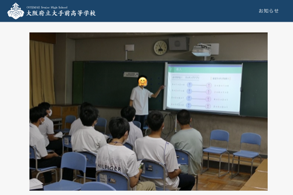

見ての通り、聴衆は男子ばっかり！理数系の宿命なのでしょうか、もう少し女子も増えてほしいものです。ちなみに、2 枚目には Y さんが発表してる様子が写っていましたが、こっちは普通に女子もいました。どうやら理系が理由な訳ではないようです。

<br />

私の後は H 君の発表だったので、適当に煽りながら聞いていました。黒板でその場で図を書いて説明するのは失敗できないので凄いですね。
やはり常人には到底思いつけない解法で鮮やかに解いていたので驚きました。発表では 3 つの問題を図形的解法で解く方法を紹介していましたが、これをどう今後の研究で発展させるのか見所です。

参考程度に、一つ問題を紹介します。

<br>

**問題**

$\sin 12^{\circ}\sin 48^{\circ}\sin 54^{\circ}$ を求めよ。

**式変形での解法**

$$
\begin{eqnarray}
\sin 12^{\circ}\sin 48^{\circ}\sin 54^{\circ}&=& \frac{1}{2}(\cos 36^{\circ} - \cos 60^{\circ})\cos 54^{\circ}\\
&=& \frac{1}{2}(\frac{1+\sqrt{5}}{4}-\frac{1}{2})\frac{1+\sqrt{5}}{4}\\
&=& \frac{1}{2} \cdot \frac{-1+\sqrt{5}}{4} \cdot \frac{1+\sqrt{5}}{4}\\
&=& \frac{1}{8}
\end{eqnarray}
$$

**図形的解法**

是非考えてみてください！！

<details>
<summary>微小ヒント</summary>
三角関数で掛け算をするという事は、斜辺の長さに三角関数を含むような三角形を考えるという事です。（それはそう）
</details>


### 5.3. 昼食

感染対策のため、各自教室で引きこもって食えとの事だったので大人しく買ってきたおにぎりとサンドウィッチを食べました。

食べ終わった後、ポスターを近くで見れるうちに見ちゃうかという事で、昼食中の教室に順番にお邪魔してポスターを眺める事にしましたが、発表者以外誰もいない教室に勝手に入るのは意外と勇気がいるものです（適当にお辞儀すれば受け入れてくれましたが）。とは言っても、悲しきかな、女子校だけはどうも勇気が出なかったので諦めました。これが男子校生です。（哀れみの目線やめてください！）

適当にうろちょろしながら Twitter を見てたら、 Y さんから京都のお土産で八つ橋を頂けるそうで、大好物なのでありがたく頂戴しようとしましたが、「その辺にいる？」って聞かれ方で、生憎うろちょろしてる最中だったのでどの辺かよく分からず、ちょっと探しましたが発表時間も近かったので（私のではないが）一旦諦めました。

### 5.4. 発表 2 回目

私の発表時間の前の 5 分の休憩の間に八つ橋を頂きに上がる予定だったんですが、生憎先生と H 君といる前で会ってしまい、そっちについて行くのはどうも気まずく適当に目配せをして後で行く事にしました（絶対に伝わってないし、若干困惑していた）。これが男子校生です。（哀れみの目線やめてください！２）

さて、発表ですが 1 回目の発表の反省点を意識し、あまり急がずに聴衆の反応を確認しながら発表したら案外反応もいいし、教室いっぱいに聴衆がいる大盛況（？）でした。
ちなみに、反応を確認すると言うのは、「〜ですよね？」と言って聴衆が鳩のように一斉に首を振っているのを見る作業です。ここで反応が悪かったら「〜というのも、〜」と続けます。
発表は対話ですから、スピーカーノートに沿って一方的にやってはいけないのです（何様？）。

<br />

結局何分かかったかは分かりませんが、手応えもありましたし、とても良い発表ができました。最近はオンライン発表が多く、オンラインでは反応を確認しづらいのでありがたかったです。明らかに内容を理解した上での踏み込んだ質問もありましたし、分かりやすい発表にできたようです。

1 回目と違って、「おわりに」で映したスライドの QR コードを読み込んでくれる人がかなり多かったのも嬉しかったです。
また、特に栃木高校の人に人気だったようで、色々と個人的な質問もされました。おっ、モテ期到来？残念、全員男子でした！（普通に喜んでます）

その後は、1 回目同様お偉いさん方の質問に答えたり（なお今回は内容を理解してくれたらしかった）、適当に他の発表を見に行ったりして残りの発表時間を潰しました。

<br />

暇になった所で、八つ橋を頂きに上がりました。何度も京都に行っていると、「この前も八つ橋買ったしな〜」とか考えて結局お土産に八つ橋を買わなくなり、それを繰り返すともう最後に食べてから 1 年くらい経っていたりするので、なんだかんだで食べるのは久しぶりだったように思います。

八つ橋といえば、去年あたり聖護院八つ橋と井筒八つ橋が創業年を巡って裁判をしていたのが思い出されますね。
確か最高裁まで行った上で、上告棄却されてイチャモンつけられた聖護院が勝っていました。貰っておいてする話ではありませんね...。

<br />

一応発表はもう 1 グループありましたが、大体見たのと、もう徹夜明けなのもあって疲れたので、教室でゴロゴロしていました。
この気持ちはそう、文化祭最終日です。文化祭はステージ FINAL があるだけだいぶいいんですが。

### 5.5. 発表後

全ての発表が終わった所で、お偉いさんのお話があるそうなので一応聞いていました。すると、なんと最初から一つずつ講評を始めるではありませんか。
発表は 73 もあるのに一体何を考えているんだと思いつつ、何て言われるか待っていたら、自分のちょっと前から飛ばされ始め、私も飛ばされました。は？

その後もちょっと飛ばしずつ、多分 30 件くらい講評をしていました。いつ終わるんだこれと思いながら待っていたら、窓からもう帰り始める不届き者がいて笑ってしまいました。

ようやく終わった後は校長先生のお話がありました。校長先生は女性だったので「ごきげんよう」を期待していたんですが、言いませんでした。サービス精神がありませんね。ただ、淀川花火大会の情報はありがたかったです。

お話が終わった後は、こんだけ発表したのに優秀発表賞とかない訳？と愚痴を言いつつ片付けをし、その日で帰る先生と別れて夕食を食べに道頓堀に行きました。

### 5.6. 夕食

とある人気お好み焼き屋さんに行くつもりだったんですが、いざ着いてみると大行列でとても待てそうにないので、他のお好み焼き屋さんを探して入りました。
後ろにアキラ 100% さんをはじめ、有名人のサインが多かったのでいいお店なんだなぁと思ってメニューを見ると、「男なら食らいつけ！　巨乳焼き」の文字が。

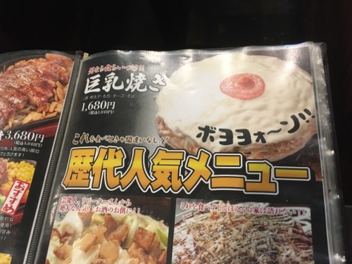{width=400px}

ちなみに、他にも美乳焼きなどもありました。おっと、入る店を間違えたか...？と一瞬戸惑いましたが、確かにここ道頓堀にはそのユーモアを受け入れる寛容さがある事に気づきました。東京だったら、きっと「女性差別だ」「キモい」「面白いと思ってやってんのか」などと叩かれて消されてしまうでしょう。エスカレーターの左右などの表面的な違いだけでなく、このような内面的な違いを実感できたのは大きかったのではないかと思います。何かと表現規制がされる今の時代に必要なのは、このような一種の寛容さなのではないでしょうか。

なお、これだけ語っておきながら店員さんに「巨乳焼きひとつ」と言うのが恥ずかしくて頼むのはやめました。これが男子校生です。（哀れみの目線やめてください！３）
これをツイートしたら同級生から「これだから DT は...」と煽られました。彼に実は卒業していることを伝えたらどんな反応をするだろう、と思いましたがやめました。正直でありたいので。

そんなこんなでチキった私ですが、頼んだとん平焼きとお好み焼きは絶品でした。とん平を食べたのは初めてだったんですが、豚肉とチーズの相性が抜群で最高でした。

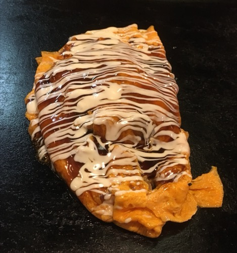{width=300px}

ところで、この店はソフトドリンク頼んでも SUPER "DRY" と書かれたビール入れるような容器に入れて出すので、マジで側からみると未成年飲酒にしか見えません。
この写真の H 君は緑茶を飲んでるんですが、大人っぽい服装してるのも相まって、色的にマジでビールにしか見えません（ソフトドリンクで緑茶飲むのも珍しいと思う）。
何か不都合な真実を突き付けられた時にこれバラすぞって脅すのに効果的かもしれませんね（やりません）。

{width=400px}

さて、寛容なのは良かったんですが、近くの客がずっとド下ネタ（ここに書けないような内容）で騒いでいたのには閉口してしまいました。衝立があったのでまだ良いですが、万が一感染したら間違いなくこの店でだと思います。こういう事には不寛容でいて欲しい所です。

### 5.7. ホテルへ

夕食を食べ終わった後は翌日の川下りのため、京都の三条にあるホテルに向かいました。
すっかり疲れ切って爆睡しまい、起こされてなかったら寝過ごしていたに違いありません（まぁ終点は近いのでいいんですが）。

ホテルの部屋はこんな感じでした。ちなみに、部屋には炊飯器やまな板、アイロンまであって完全に住むのを想定されてるような感じで面白かったです。

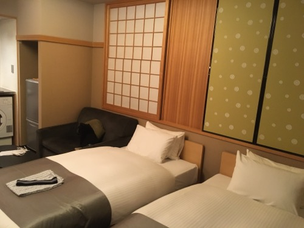{width=400px}

いくら疲れていても、リコリコのリアタイはしたかったのでテレビで見ました。ED 直前のシーンには涙を浮かべずにはいられませんでしたね。

終わってからは速攻で寝ました。

## 6. Day2 (8/28)

### 6.1. 朝

普通に寝たつもりが全然眠れておらず、結局 4 時間くらいしか寝られませんでした。ホテルの朝食の開始が 7 時半らしいので朝食券を持って向かうも、なんと空いていませんでした。あれーと思いながら待っていると、受付スタッフの人がやってきて朝食係（？）の人と連絡を取ってくれて、どうやら絶起したようである事がわかりました。

なお、いつも遅刻をしている私共としては何も文句は言えません。少し待っていると、時間がかかりそうとの事なので受付の人がおもむろに金庫を開けて 1000 円を渡してくれたので、近くのヤマザキパンで買って来る事になりました。今思うと「1000 円で足りますか？」と聞かれた時に承諾せず「いや〜成長期なので足りませんね！」とか言ってたら普通にもっと渡してくれた気がします。もっとも、弱みにつけ込むのは嫌いなのでしませんが。

元々朝食はパンとコーヒーと聞いていたため、1000 円の朝食となればこれはかなり豪華になるなぁと思いながらヤマザキパンに向かうと、美味しそうな手作りパンが所狭しと並んでいたので、得意の暗算を活かしてなるべくギリギリまで買い込む事にしました。会計の直前に手作りパンが 50 円引きである事が分かったので、ついでにチキンも買って 2 人合わせて 1960 円くらいになりました。上出来！

{width=400px}

これが一人分です。なんて豪華な！　絶起してくれた係の人には感謝です。怒られたと思いますが気を強く持ってほしい所です。
ちなみに、普通に食べ切れなかったのでラスクとランチパックは昼食行きになりました。

### 6.2. 保津川下り

今回の旅行で最も楽しみにしていたイベントの一つです。およそ 1 時間半掛けて 16 km 保津川（桂川）を下ります。

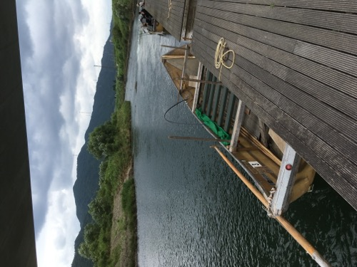{width=400px}

さながら自然のアトラクションですね、いくつも急流があって、その度に水飛沫が掛かってとても爽快です。
イメージとしては、ディズニーのカリブの海賊で落ちる箇所があると思うんですが、あれ以上のスピードが続く箇所がいくつかある感じです。
とは言っても、スプラッシュマウンテン程ではありませんw

私が乗った時はおよそ 1 時間半掛かるとの事でしたが、水量によっては 50 分で下る事もあるようです。その時は頭から波を被るそうで、大変楽しそうです。

そして、カリブの海賊との違いは船頭さんのトークです。大変な力仕事をしながら面白いトークを繰り広げるのですから凄いものです。
個人的に好きだったジョークを挙げましょう。

- (出発直後の欄干がない橋を指して)あの橋なんていうか知ってます？　渡月橋。

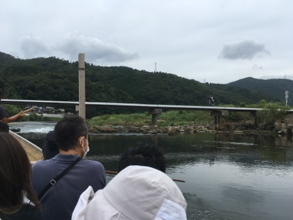{width=400px}

- 降り場の方向に向かうトロッコの乗客には手を降らなくていいですけど、乗り場の方向の乗客には全力で楽しそうに手を振るんですよ！

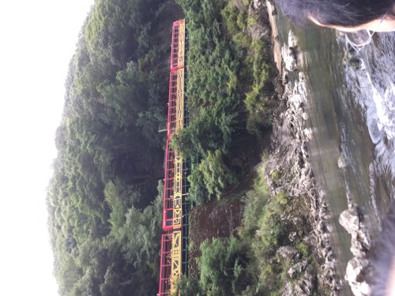{width=400px}

- (岩から飛び込むラフティング勢を指して)あの人たちはここら辺の原住民で、あそこから飛び込むことで晴れて成人となるのです。

{width=400px}

- サギが多い理由わかりますか？カモがいるからです。

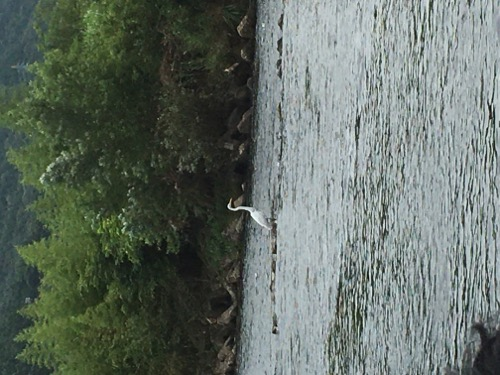{width=400px}

ジョークだけでなく、豪雨の時の被害についてや、春に見られる桜、秋に見られる紅葉などについても語ってくれました。
今度京都行く機会があったらまた乗ってみたいものです。

本物の渡月橋近くで降りると、ミニ屋形船が泳いでいて面白かったです。誰が操縦してるんだと思ったらおじさんがラジコンを操作してました。

{width=400px}

嵐山では、街を歩きながら「この街並みはディズニーランド同様、観光客向けにコスプレをしているだけで、嵐山の街並みは存在せず、テーマパーク嵐山なのでは？」というような話をしていました。雰囲気ぶち壊しやめなさい。

ところで、5 月に遭遇したまどかちゃんの八つ橋は健在でした。Cool Japan!

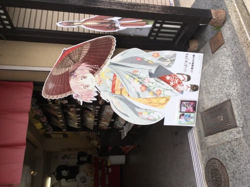{width=400px}

### 6.3. USJ

さぁやってきました USJ、人生初！

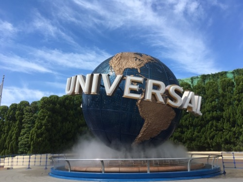{width=400px}

さて、いよいよ入場時間です。エントランス前には手荷物検査官（？）のお姉さん方が腰に手を当てて、制服に警察の付けるような徽章を付けて目を光らせています。パークの安全は私たちが守るといった感じでしょうか。

ところが、手荷物検査は事前に入場者が開けた大きなチャックのみ適当にちょろっと見て、後は重さを確認するだけで検査など碌にしていませんでした。あれでは例え銃が入っていても気づかないでしょうね、あの検査官のドヤ顔は一体どこから生まれてくるのか不思議です。せいぜい上司の指示に従ってペットボトルの本数でも取り締まっていればよろしいのではないかと思います。それさえ気づかなそうですが。

<br />

愚痴はこれくらいにして、3 時間しか滞在できないので目一杯楽しむ事にしました。H 君がハリーポッターの大ファンで、世界観を再現した所を見るだけでも相当楽しみだったそうです。私は金ローで放送してたら見るくらいのにわか未満なので色々教えてもらいながらまわる事にしました。

まず目に飛び込んできたのはこちらの機関車です。9 と 3/4 番線というらしいです。京都には 0 番線がある事で有名ですが、なんとこちらは分数です。複素数が出てくるのも時間の問題かもしれません。それにしてもよく作られています。

{width=400px}

お目当てのアトラクションがこちらのお城（学校）の中にあるそうなので入ることにしました。入り口には待ち時間 40 分と書かれていましたが、ディズニーよりは全然マシなので待つことに...と思ったら全然待ちませんでした。回転寿司並みのスピードでストップなくどんどん客が乗り物に乗っていくからです。

中身は屋内でライドが回転するのと映像を組み合わせたようなアトラクションで、映像で体感できる空を飛ぶスピード感が何とも爽快でした。ただ、予想以上に動きが激しかったので H 君の体調が悪くなってしまったようで申し訳なかったです。

<br />

さて、その後は私が先に酔わなさそうなアトラクションに先に乗って大丈夫そうだったら彼も乗る事になったんですが（毒味かな？）、それで JAWS に乗ろうとするとシングルライダー用の入り口がありそっちに案内されました。一般列は 70 分待ちだった訳ですが、なんとシングルライダーに並んでいるのは私含めて 3 人でした。考えれば分かりますが、グループをまとめて案内するとかなりの確率で端数が出るのでそこに入れてくれるという訳です。毎回端数が出ていたので順調に進み、5 分と待たずに乗ることができました。

別にこのシステムは複数人で来ていても分かれて乗ることを受け入れるならシングルで入っても良い訳ですし、また一般列に並んでいる人もエクスプレスパス列に並んでいる人も、異様にシングルが空いていて、70 分も待たずにすぐに乗れる事は容易に分かるはずなのですが、それでもシングルの列には入りたがらないようです。まぁこういう所に来ている人は群れで行動し、シングル改めぼっちを哀れみの視線で見る習性があるようなのでそういう事です。

結局 JAWS はほとんど揺れはなかったものの乗らないことになったので、最初に乗ったアトラクションが相当ヤバかったようです...。

<br />

その後はお土産を買ったり、アトラクションに乗ったり、散歩したりして時間までは滞在しました。本当はもうちょっと滞在したかったですが、それだとまた新幹線の終電になってしまうので諦めました。

## 7. いかがでしたか？

後半もうだいぶ文章が適当になってますね、すみませんでした。