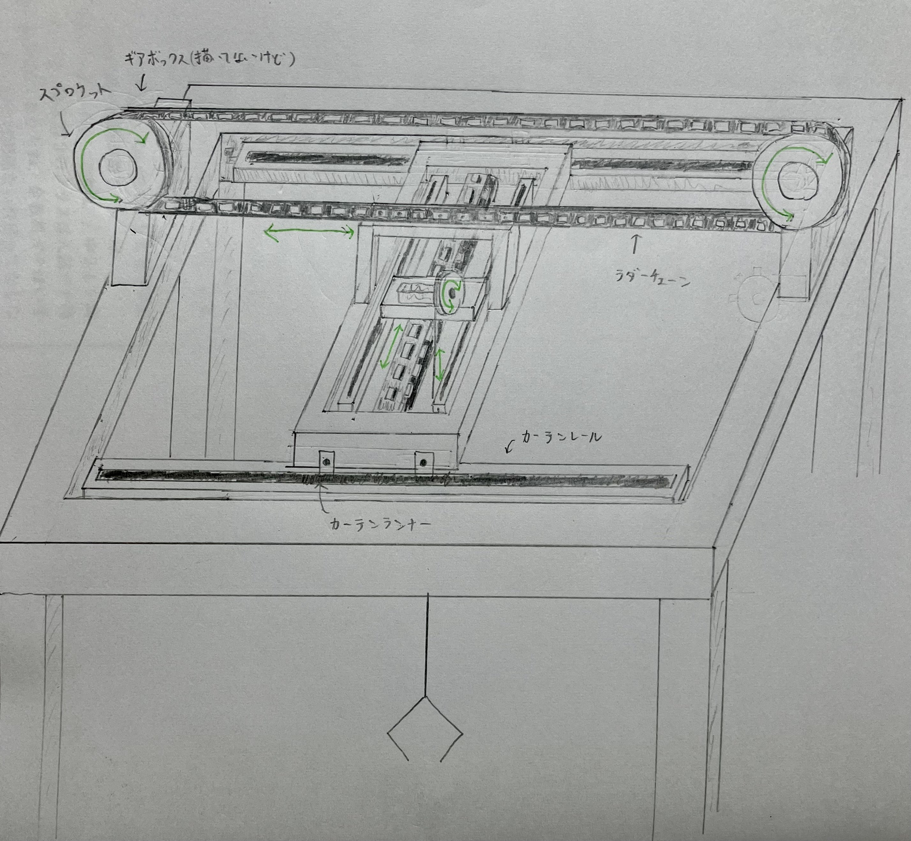
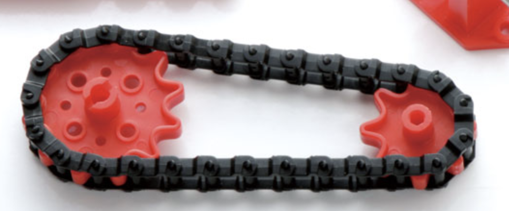
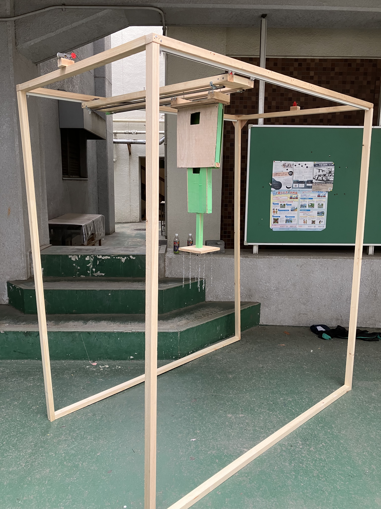

<a href="https://twitter.com/share?ref_src=twsrc%5Etfw" class="twitter-share-button" data-show-count="false">Tweet</a>

## 0. 概要

七月の模擬文化祭が終わった所で UFO キャッチャー制作の作業進捗を紹介していきます。

私は主に XYZ 移動機構の設計を担当しているんですが、アームがなくなりフック式になった関係で、チームとしての作業は移動機構の設計を形にしていくものとなったため、備忘録的にこれを書いています。夏休み忘れちゃいそうですし。

## 1. 設計

7/1 の深夜、眠れなかったので 3 時間くらい掛けて頭の中にあった構想を図にしました。基本的に作業をする中で設計は変わっていくので、長さは特に決めず感覚で描きました。カーテンレールの向きが違ったりする事以外は、ほぼこのまま現物になりました。

{width=350px}

設計は階層構造になっています。まずワイヤーの巻き上げで上下に移動する Z 軸機構があり、それをチェーンで奥行き方向に移動させる Y 軸機構があり、さらにそれをチェーンで横方向に移動させる X 軸機構があります。

X,Y 軸機構は仕組みとしてはほぼ同じで、下図のようにラダーチェーンをスプロケットという歯車にかませ、スプロケットをギヤを付けたモーターで回転させる事で平行移動を生み出しています。ここで、カーテンレールにランナーで吊り下げる事により滑らかな移動を出来るようにしています（図ではカーテンレールに載せていますが、結局吊り下げました）。

{width=350px}

一方、Z 軸機構はギヤを付けたモーターでワイヤーを巻き上げる事により上下移動を生み出しています。

仕組みとしては簡単ですね。ただ、カーテンレールで土台を挟んで動かす時に、左右の進む速度が違うとガタガタになってしまうため、色々心配ではありました。

## 2. 作業

### 2.1. 6/29(木)

五月に必要そうな部品を適当に買っていたんですが、六月は音楽祭やら、コロナやらで作業が出来なかったので、回復した日にアトラク長の R 君に「七模擬あと二週間だけどやばくな〜い？（適当）」的な事を言って、ラダーチェーンを組み立て始めました。チェーンなので一つずつ切り出して組み立てるので結構大変なんですよね。。。期末前日ということもあり、それくらいしか進みませんでした。

しかし、それまで実体が何もなかった事を考えると、大きな進歩！

### 2.2. 6/30(金)

期末の Day1 という事で、X 軸機構のカーテンレールで木材を吊り下げてチェーンで動かす所までやろうとしましたが、ギヤボックスを木材を固定する方法が分からなくなった所で終了しました。ギヤボックスの出力シャフトにスプロケットを付けて回転させ、チェーンを動かす訳ですが、チェーンで何かを引っ張る以上はギヤボックスにも相当の力が掛かります。しかし、付属の固定部品はそれに耐え切れず取れてしまいました。

この問題は、後にギヤボックスの周りに釘を打ち込む事で動けなくする事で解決しました。

そして、この夜に上述の設計を描きました。

### 2.3. 7/5(水)

期末最終日という事で、午後から 2 時間程金曜日の続きの作業（実験）をし、兎にも角にも「土台をラダーチェーンを使って真っ直ぐ移動させる」のが技術的に可能である事が分かりました。ただし、伸縮式カーテンレールを使っていた関係でレールの継ぎ目に引っ掛かってしまう問題が露見しました。逆に、継ぎ目をなくし片方だけだと可動域が短過ぎました。

という事で、別の長いカーテンレールを発注する必要がある事が分かりました。

{width=350px}

### 2.4. 7/7(金)

この日は絶起したり、3D プリンターが壊れたりして散々でしたが、アトラク長の R 君とハンズに買い出しに行った時に色々と着想を得る事ができました。

そもそも、買い出しに行ったのは Z 軸機構でギヤボックスの出力シャフトに合う、ワイヤー巻取りに使うボビンを探すためでした。これに関しては、なぜかクランクプレートという部品とボビンのサイズが丁度合っていたため、穴にネジを差し込んで固定する事で解決しました。

また、3Dプリンターが壊れた事でアーム制作は絶望的になりましたが、途中でゲーセンに入った事により、UFOキャッチャーの中にはフック式のものがある事を知り、これなら作れそうという事でついでにハンズで部品（フック、リング他）を調達しました。また、元々 X,Y,Z 全てタミヤの「標準ギヤボックス」を使っていましたが、Z 軸機構に関してはパワーが心配になったので「シングルギヤボックス」に変えました。

（余談）帰りに渋谷でナポリタンを食べて帰りました。おいしかったです（小並感）

### 2.5. 7/10(月)

理系は登校日だと思ってたら休みでした。気付いたのが電車の中だったので、結局 R 君と寂しく作業をしました。ゲーセンで見たものよろしく、土台のコンパネを切り出し、チェーンをいくつか取り付け、その先端にフックを吊り下げる形にしました。

{width=350px}

チェーンを固定するのは工夫が必要でしたが、チェーンの継ぎ目部分に釘を数本打ちつける事で完全に固定する事ができました。

また、ボビンをクランクプレートに取り付け、ギヤボックスで回転させてワイヤーを巻き取る機構も制作しました。ワイヤーの固定には別の器具が必要そうだったので、取り敢えずタコ糸で代用しましたが、「ほぼ」上手く行きました。（後述）

（余談）金曜日に食べ損ねたラーメン一蘭を食べに行きました。おいしかったです（小並感 2）

### 2.6. 7/11(火)

この日こそ登校日だったので、1 時間程作業をしました。フックが複数ある以上、端に景品が掛かるとモーメントで傾いてしまうので、上図のように固定の外枠から可動の内枠がせり出す機構を作りました。図では二重「マトリョーシカ」構造になっていますが、可動域の長さ的に三重にする必要がありそうな事が分かりました。

というのも、可動部分は固定部分より長く移動することは出来ないわけで、40cm動かしたかったら固定枠も40cm以上必要なんですよね。それをすると筐体の高さ的に可動域が減ります。三重にすれば、40cm動かしたければ固定枠は20cmあれば十分という訳です。

### 2.7. 7/12(水)

まずマトリョーシカ構造を三重にしました。そして、タコ糸を付けて上下移動させようとした時、先程の「ほぼ」上手く行った時の問題が露見しました。ボビンとクランクプレートはネジとナットで固定しているんですが、このナット部分にタコ糸が引っ掛かったり、タコ糸同士で絡まったりして、止まったり逆方向に進み始めたりする事がありました。そこで、パテでナットの隙間を埋めようとしましたが、結局タコ糸特有の問題が残ってしまったため、タコ糸は諦める事にしました。

残るはワイヤーですが、なぜかボビンの穴を二周縫うようにしてみたらいい感じに固定でき（あとでちゃんとスリーブで固定しました）、巻き上げに成功しました。これにより、Z 軸機構が完成。

七模擬まで、残り 3 日！

(余談) 帰りに鉄緑に行く前に侍で肉増しラーメンを食べました。おいしかったです（小並感 3）

### 2.8. 7/13(木)

Z 軸機構を動かすための Y 軸の土台とカーテンレールを取り付け、ラダーチェーンで移動出来る事を確認しました。

また、ギミックとして景品を置く床を回転させたかったんですが、電動回転台は高かったので安いアナログ回転台を買い、その周りに余ったラダーチェーンを取り付けて、スプロケットに噛ませてモーター（ギヤボックス）で回転させる事により、自作電動回転台が出来ました。先述の Z 軸だけでなく、XY もギヤボックスをトルクが大きいものに変えたため、元のギヤボックスが余ってしまったため、それを有効活用（？）した形です。

ここまで来ると完成しそうな気がしてきたので、七模擬当日がかなり暑い、という事でプレイを有料化して景品をアイスにしよう！という構想が進み、昼頃に氷屋にドライアイスを買いに行き、クーラーボックスの性能を確かめた他、帰りにアイスが安いスーパーを色々当たりました。結局、有料化は先生に止められてしまいましたが・・・。

### 2.9. 7/14(金)

残るは X 軸ですが、こちらのカーテンレールはランナーが小さいため、Y 軸のように釘で固定するのがかなり難しくなっていました。そこで、木工に詳しい Y 君の技術によって U 字釘で固定する事になりました。これはそれなりに苦戦しました。何度も外れましたし。

これが安定した後は、ついに筐体の立体化に着手しました。これまではただの機構なので、それを立体的に設置しないといけない訳です。

木工に関しては私はど素人なので、プロがいて助かりました。私がやってたら筐体が崩れて全部壊れて台無しでした。画像は立体化の途中です。これじゃ強度最悪なんでね...。

{width=350px}

### 2.10. 7/15(土)

七模擬まで残り一日となりました。筐体を強靭にする作業と共に、配線作業が始まりました。X,Y のモーターはいいとして、Z 軸のモーターは縦横無尽に動くので、普通に配線を繋ぐと景品に引っ掛かってしまう訳です。ここで、S 君の思いつきにより、Y 軸のカーテンレールに電気を通してみた所なんと通じたので、Z 軸の土台を吊るすだけでなく、電気を通すレールとして活躍してもらう事になりました。ステンレスなので抵抗はそれなりにあるんですが、あまり問題はありませんでした。

これにより、XYZ 全ての機構が筐体上で干渉なく稼働出来る事が確認できました！！パチパチ〜

{width=350px}

とは言っても、乾電池を毎回向きを変えてやってるだけなので、ユーザエクスペリエンスは最悪です。という事で、ここからはトグルスイッチを取り付ける必要がありました。

### 2.11. 7/16(日)　七模擬 Day1

午前中はトグルスイッチのはんだ付けを S 君にやってもらいました。私は中学の技術の授業以来やってないんですが、あれ意外と時間掛かるんですね...。

ところで、景品をアイスにして有料化しようとした所頓挫した、と先述しました。とはいえ景品は流石に必要だったので、倉庫にあるらしいチュッパチャップスをあてにしてポスターを R 君が作ってくれましたが、倉庫にあったのは賞味期限切れの中華製パチモンチュッパチャップス（保存状態最悪）でした。我々でも流石に食べたくなかったので、チュッパチャップスを買いに行こうとしましたが、1 本 30 円と割高だったので、同じくらいの値段のパピコに変える事にしました。暑いんでね。ここで、木曜日にアイス計画のために、氷屋でドライアイスを調達する用意をしていたのが効きました。

諸々の準備が整った所で、13 時頃についに稼働しました！！　他のアトラクは稼働してなかった（その後いくつか稼働）ので、二週間前はうちのアトラクが進捗最悪だった事を思うとよくここまで出来たなという感じです。木工のプロがいるのと、メンバーがみんな毎日来てくれるのが本当に大きかったです。あと雰囲気も良かった。雰囲気作りって結構重要で、リーダーが気さくな感じだと本当にやりやすいですよね。ありがたい限りです。

ただ、アンケート結果から分かるように UI の部分、つまりスイッチの部分がかなり扱いづらかったようです。それはそうですよね、即席で固定もしてない訳ですから...。本番までにはまともなボタンにする必要があります。あと、模型に詳しい顧問によると Z 軸のモーターのブラシがすぐに寿命を迎えそうなので、他のモーターにした方が良いとの事でした。

<video controls width=350px>
    <source src="./IMG_0939.mp4" type="video/mp4">
</video>

### 2.12. 7/17(月)　七模擬 Day2

暑いのと、Day1 から進められる事もほぼなかったので稼働時間は短くして休んでいる時間が長かったと思います。食品班おいしかったなぁ（小並感 4）

一方、途中でボビンとクランクプレートを固定していたナットが緩み、色々外れる事案が発生しました。その後、適当に付け直したらまた外れました。ちゃんとスパナで留めたら直りました。横着はしないようにしよう。

## 3. まとめ

ただの作業記録にまとめも何もないですが、短期間で形に出来て良かったです。これなら秋は勉強できるな！笑