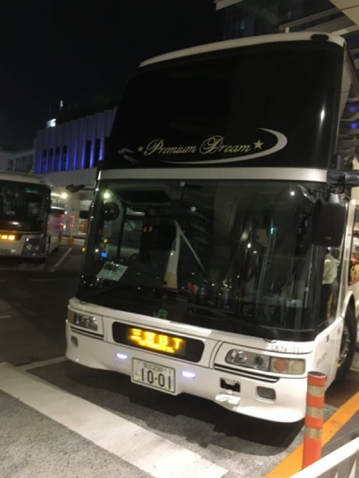
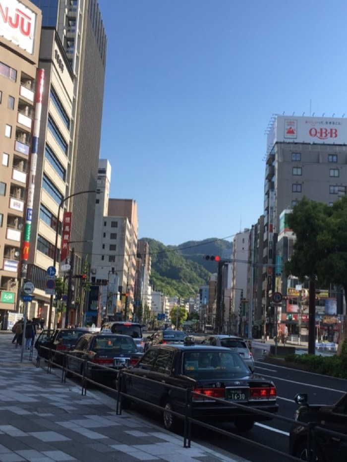
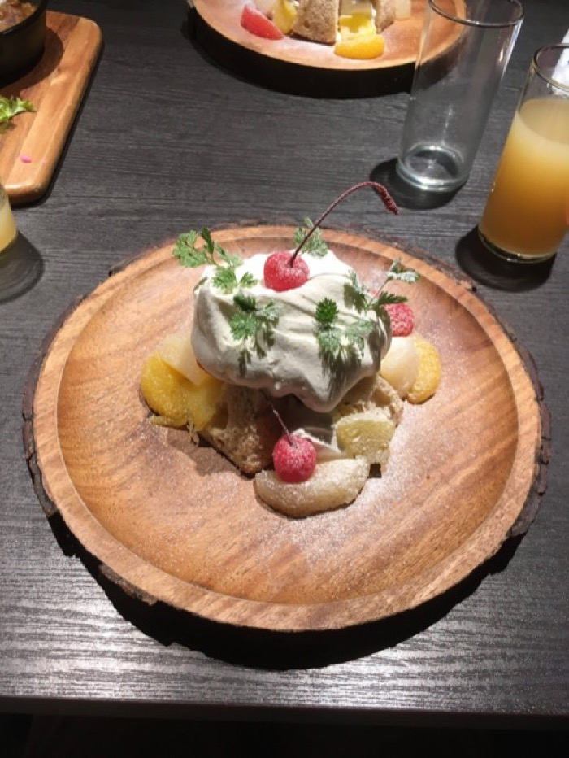
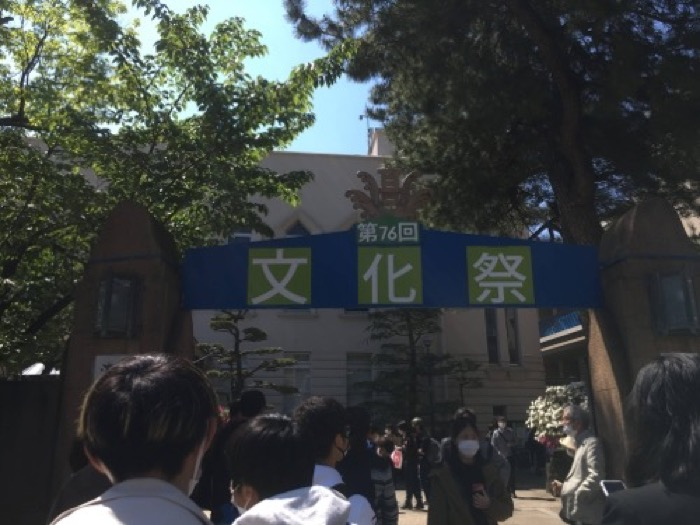
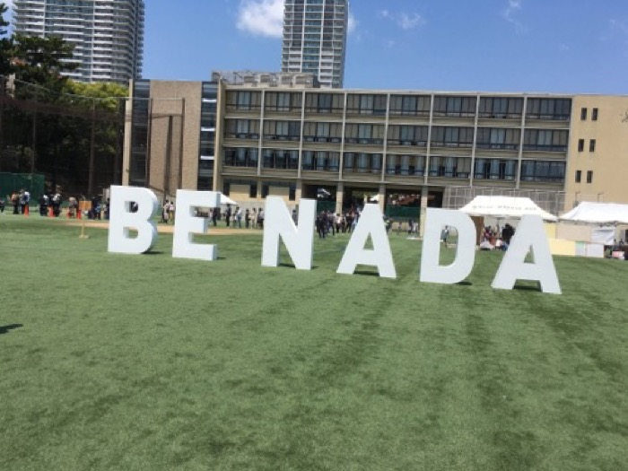
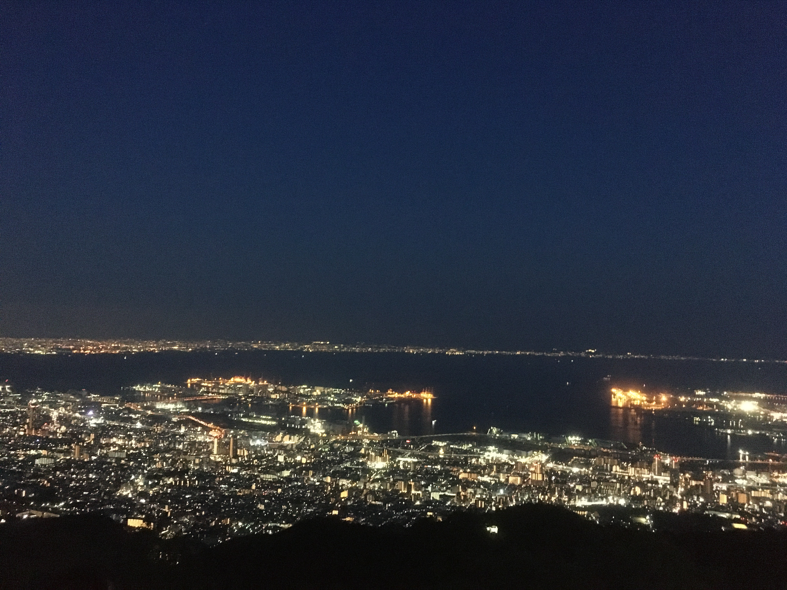
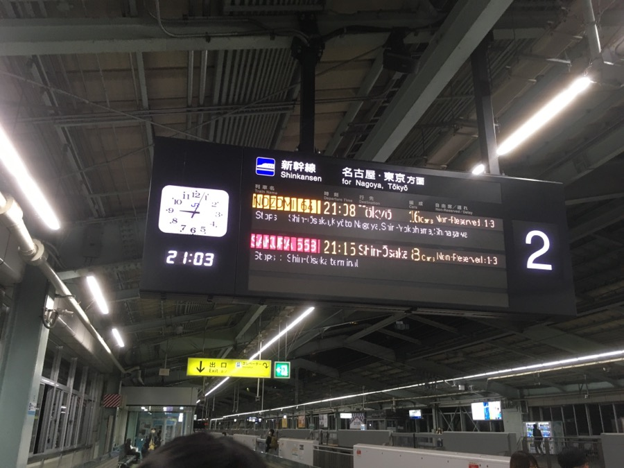

<a href="https://twitter.com/share?ref_src=twsrc%5Etfw" class="twitter-share-button" data-show-count="false">Tweet</a>

文実有志で灘校文化祭 2022 "Turn it over" に行ってきました。後々参考になることもあるかもしれないので一応記録を残しておこうと思います（大体遊んだだけだけど）。

## 5/2

バスタ新宿から夜行バスに乗る事になっていたため新宿に向かうも、駅で迷子になりました。降車後に一度階段間違えたら駅から出るまで所望の出口に出られないのは構造上の欠陥だと思いますね、はい（早口）

スタバ前で集合してたので、景気付けにと思って適当にキャラメルマキアートを買ったんですが、寝る前にカフェイン多そうなもの飲んだのは明らかに失敗でした。

↓カフェイン漬けの 3 人

{width=500px}

いよいよバスに乗り込みます。なんと 8 時間も掛かります。なげ〜〜

{width=300px}

## 5/3

### 朝

7 時に 1 時間遅れくらいで三宮に到着しました。それにしても都市部のすぐそこに山脈があるのには驚かされました。知識として知ってはいましたが、実際に来てみるとその近さが実感できます。

{width=300px}

朝食を探す旅に出ていたらおしゃれなカフェがあったのでそこで食べることにしました。

いや〜優雅な朝ですね。僥倖っ・・・！なんという僥倖・・・！ ~~ざわ~~

{width=300px}

食べ終わった後、まだ灘に行くには早い気がしたので花時計とやらを見に行きました。それにしても三宮の道はとても広いですね、幕張のような再開発された都市にはありがちな気がしますが解放感があって好きです。

{width=500px}

歩道橋の上から見るとよく見えるんですが、ミッフィーかと思ったらマイナンバーのマイナちゃんでした。流石に草。国家のウサギがよぉ（？）

### 灘校文化祭

さて、灘に着いたはいいものの、受付時間前にも関わらずかなり人が多くて驚きました。2500 人程度で入場制限が掛かると聞いていたので、入れなかった場合のプラン B を考えるくらいには多かったです。
実際には来た人が追い返される事はなかったように見えたので、入場制限は行われなかったものと思われますが、実地で先着制を取るのは明らかに悪手なので筑駒ではやらないようにしようと思いました。（何様？）

結局 10 時くらいになんとか入れました。良かった〜

{width=300px}

灘ではクラスで出し物をする事がない事もあってか、ステージに重きを置いているように思いました。筑駒はステージが 1 つしかありませんが、灘には 3 箇所くらいありました。もっとも、筑駒がステージ外でステージみたいな事をやっているだけという説はありますが・・・（コント班、音楽部など）

また、各団体の外装がほとんどなかった（内装でも木材はあまり見なかった）代わりに校舎の内装が凝っていました。ステンドグラス風の装飾なんかはかなりクオリティが高くてすごかったです。

{width=300px}

壁にアニメのキャラクターの絵が貼りまくってるあたり、著作権が大丈夫か不安になりますが例年こうらしいので多分大丈夫...なんでしょう。知らんけど。

あとは、校内サインが見やすかったのはとても参考になりました。
さて、メタ的な感想はこれくらいにして、中身で印象的だったものについて書いていこうと思います。

まずはステージの ODORIBA です。招待してくださった、面白人間として名高いミツバチさんが踊るらしいので観ていました。実は K-pop をコンギョと Make you happy くらいしか聞いたことがなかったので（は？）Butter を聞くのは多分初めてでした。最後に頭撫でられてたのが面白かったです（笑）

次に NPCA ですが PCT, blackyuki, Kodaman あたりの強い人とまた会えて嬉しかったです（せいぜい 1 ヶ月しか経ってないけど）。PCT に覚えられてたの奇跡では？　~~*** たんフォローしたい~~

あとは LEGO 同好会、アニメ研究会、鉄研、物理研究部あたりが印象的でした。特に本物（？）のウマ娘の皆さんに会えたのはびっくりですw　鉄研が Python で制御していたのも興味深かったです。
全体的に入ってから出るまでの時間が短い団体が多かったので短時間でほとんど回れた気がします。以下写真集です。

顔が写ってて隠すのが面倒になった写真は入ってません（というか大体写ってる）。

{width=300px}

{width=300px}

{width=300px}

### 夜景観光

待ち合わせまでちょっと暇になったので三宮の Round1 で 1 クレだけ CHUNITHM をやった後、摩耶ケーブルカー・ロープウェイに乗って夜景を見に行きました。

{width=300px}

ケーブルカーはまともだったんですが、ロープウェイが完全に満員電車のそれ（定員ギリギリまで詰め込まれる）で面食らいました。とは言え、景色は最高でした。
こんなに海が近いなんて！　メリケンパークも行きたかったんですが、時間がありませんでした。残念。

{width=400px}

登り切った後もまだ若干明るかったので暗くなるまで待つと、そこにはどこかで見た通りの夢のような景色が広がっていました。登って来た価値がありましたね。

{width=600px}

さて、夢中になっていたところで Asosan があることに気づきます。

**「あれ、ロープウェイの帰りの列が長くなってる」**

### エクストリーム帰宅

なんと、普通に帰ろうとすると新幹線の終電に間に合わない事が判明します（絶望）。新神戸から東京まで向かう新幹線の終電は 21 時なのです。

男子高校生 4 人が終電に間に合わなかったところで、残念ながら「終電、なくなっちゃったね・・・」とはならず、そこにいるのは、ただ家に帰れなくて立ち尽くす 4 人！（ちなみに百戦錬磨の旅行好きによると、空港に宿泊するとタダで夜を明かせるらしいです）

空港に行く方法を探そうとした所で、ギリギリ間に合うかもしれない方法が示され、いよいよエクストリーム帰宅の始まりです。

{width=500px}

それにしてもケーブルカーの下りというのは結構スリルがあるものですね〜　なんて言ってるのは束の間、ケーブルカーを降りた後はバス停までずっと急な下り坂をダッシュです。ここからはバスに乗れさえすればイージーモード・・・かと思いきや、バスを降りてから新神戸駅までまたダッシュ。

そう、我々はまだ夕飯となるべきものを買っていないし、まず新幹線の切符すら買っていないのです。

この光景、以前にも見ましたね。そう、半年前の京都大学研究室訪問です。この時は清水寺が予想以上に混んでいて、京都タワーに登っていたら駅弁を買う余裕がなくなったのでした。

結局なんとか切符を買いましたが、駅弁は 2 種類しか残っていなかったので柿の葉寿司を買いました。神戸牛食べたかったよおおお（大声）
最終的にホームに着いたのは終電発車 5 分前。

{width=500px}

かくして、我エクストリーム帰宅に成功せり。やっぱり旅はスリルがあった方が楽しいですね！！！皆さんも旅行をする時には終電ギリギリまで観光してみてはいかがでしょうか？

さて、新幹線内ではいつも通り ｼﾝｶﾝｾﾝ=ｽｺﾞｲｶﾀｲｱｲｽ （今回はチョコ味）を食べたり、買った柿の葉寿司を食べたりしました。

東京駅には 23:45 に着きましたが、ここである現実を突きつけられます。

**在来線の終電が発車直前**

そう、エクストリーム帰宅は終わっていませんでした。ここからは、間違ったホームに降りたら駅員さんに「もう電車終わってますよ！」って叫ばれたりした事以外あんまり面白い事はなかったので割愛したいと思います。色々ありましたが、家には 4 日の 0:30 くらいに着きました。一歩間違えたら帰れてなかったと思うと、まさしくエクストリームの名がふさわしいですね。

い　か　が　で　し　た　か　？

灘校文化祭でお会いした方々は、また筑駒文化祭でお会いできる事を楽しみにしています。今年こそは来場者が自由に入れる事を願って、それでは。