<a href="https://twitter.com/share?ref_src=twsrc%5Etfw" class="twitter-share-button" data-show-count="false">Tweet</a>

少年時代とは儚いもので、過ぎてしまえばそこにあるのは漠然とした記憶、幾らかの写真、そして稚拙で読むのも億劫な文章の数々...。
青春の一ページなんて恥ずかしいワードを使うつもりは毛頭ないけども、青春を駆け抜けた証を残したい気持ちくらい、10 年後の自分も分かってくれるよね。

あれ、これ運営記に書く事じゃなくない？というツッコミは置いといて（参加記にしてもおかしいと思う）、大体時系列順に記していこうと思います。
一番作業してたであろうオリバーさんが大体書いてくれているので、自分の担当部分以外は省略気味です。

↓　各種運営系資料まとめ

[パ研合宿2021運営記（前半） by oliverx3](https://oliverx3.hatenablog.com/entry/2022/04/01/160655)

[パ高会2020開催記 by Thistle](https://thistleprogram.hatenablog.com/entry/2021/02/01/124602)

[パ研合宿開催マニュアル by E869120](https://drive.google.com/file/d/1ldtdScUErTKYeLu8CvEgUlttgkoCp17G/view)

## 7 月

運営が大体 Discord 鯖に入ったくらいですね。
この頃のオリバーは割と（笑）な感じだったので（本人の名誉のために詳細は伏せる）、今後の彼の活躍を予想する者はいなかったのではないかと思われます。

## 10 月

運営長と会計が決まりました。もしかして進捗、遅すぎ...？

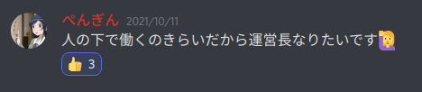

## 11 月

文化祭も終わり、ようやく運営鯖が動き出します。とは言っても、今年は宿泊しようとか、いつやる？とかそれくらいだったけど。

この頃の作業進捗の悪さと感染状況の見通しが分からない事から、正直な所、宿泊開催まで出来るとは思っていませんでした。

## 12 月

作業分担を決め、いよいよ作業に取り掛かり始めます。私は kaage と共に講演会+レク+LT 担当になりました。

そういえば kaage と作業した記憶がほぼないですね、まぁ彼は Freedom の準備で忙しそうだったからしょうがない。

## 1 月

取り敢えず 4 日間開催する事になったものの、コンテストその他の企画が少な過ぎるという状況でした。コンテストの問題原案が足りなさすぎたんですね...。
去年の企画不足に対する苦肉の策としての Freedom を入れてもまだ足りなかったので、今回は講義をちょっと多めにする事になりました。

結局、Day1 が UTPC と被ってスタートが遅くなったり、何故か Freedom が企画最長の 4 時間を取ったりした結果時間は足りなくなりましたが。
それと元々レクは 1 時間程度の想定だったんですね（企画を出す前の段階）。

## 2 月

我がレクリエーションで企画をいくつか出し始めました。XOR ビンゴ、ジェスチャーゲームなどなど、質はあまり高くはありませんでした。

Codingame 的な企画をやろうとも思っていましたが、普通に春合宿もあるし 1 ヶ月でジャッジ作るのも大変そうだし・・・って事で半ば諦めかけていました。

 

講演会も担当しているので、講師を誰にするかも話し合いました。色々あって、双子、noimi さん、tatyam さんに決まりました。
私はパ研公式 Twitter の運営もやっているので、外部参加者を募ったり、講師と連絡を取ったりしました。普段のアカウントで緩めにリプしてるアカウントと完全な敬語で話すのって中々大変ですね。
出来たてホヤホヤのｴｹﾁｪﾝ鯖に招待しちゃったり、講師との連絡が遅れたりとちょこちょこ戦犯やらかしていたのはごめんなさい。

さて、予想以上に外部参加者の申込みが多かったので、抽選をどうするかという話になりましたが、結局全員通す事になりました。いい話。
抽選（全員同様に確からしいとは限らない）をやる案もあった事は...ありません。はい。

ここで、運営の企画系担当（ぺんぎん, define, kaage, ぷらにゃ）が全員春合宿で直前に抜けてしまう事に気づき、ちょっとピンチ。

 

2 月末にはいよいよ企画を決めようという事になって、結局対戦ゲーム AI を作る Codingame 的な何かになりました。

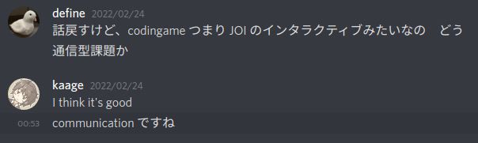

没になった問題設定案を上げておきます。

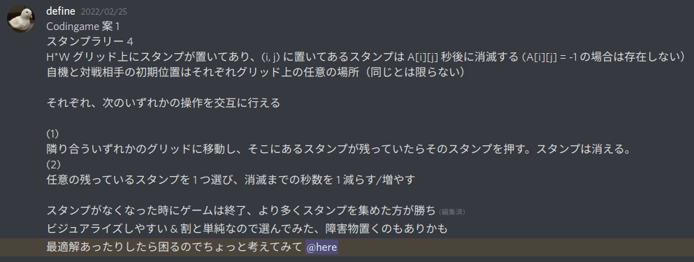

実際の問題設定との共通点は、グリッド上のものを集める所ですかね。盤面に数字とかを書く訳なので、今思うとビジュアライズはちょっとしにくい（というか分かりにくい）と思います。

 

部屋割りを決めたのもこの時期です。断言しよう、運営鯖が一番動いていたのはこの時です。まぁそうなるよね。

2 部屋程運営の暴挙みたいな部屋がありますね。運営の最悪発言集も大体ここで生まれています。何があったかはここには書きませんが、気になる人は DM で聞いてみるといいかもしれません。
一応言っておくと、各部屋でコンセプト的な何かはあるらしいです。

 

ぺんぎんにパ研杯の問題原案を投げ出したのもこの頃です。

## 3 月上旬

期末の間と 71 （つまりオリバー）が校外学習で抜けている間に運営鯖は全く動きませんでした。私はいくつかの作業を忘れていました。
帰ってきてからこの有様を見ることになったオリバーの苦痛は想像を絶するものがありますね、本当にごめんなさい。

さて、レクの方は Codingame をやると言ってもジャッジをどうするか決めかねていました。
オンラインジャッジを作るのは大変過ぎるし、かと言って†誠意の手動ジャッジ†は同時にちょっとしかジャッジ出来ないしつまらなさそうだと思っていました。

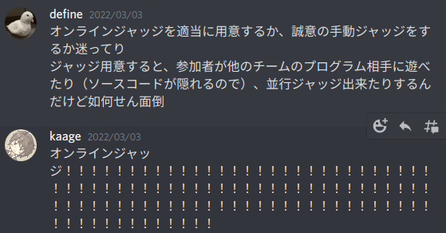

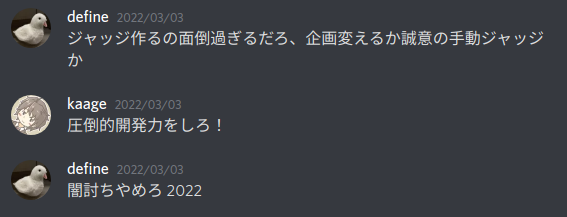

折角レクをやるなら参加者に最大限楽しんでもらいたかったし、なんとなくオンラインジャッジを作りたい気分でもあったのでオンラインジャッジを作る事にしました（英断）。
時間がなくてチームの提出したプログラムと人間が対戦する機能は作れなかったけど、まぁご愛嬌という事で。
結局作り始めたのは 3/5 でした。

講演会の方はと言うと、講師に時間を決めてもらう形にしていたのでギリギリまでスケジュールが確定出来ませんでした。来年は時間を固定してお願いした方が良いと思います。

## 3 月中旬

春合宿精進しなきゃ〜と言いながらレクのジャッジ制作に勤しんでいました。
オンラインジャッジの構成は、

1. フロントエンドサーバー　・・・　その名の通り　いつも通り TypeScript + React
2. API サーバー　・・・　提出をしたり、対戦（チャレンジ）の申込みをしたり、結果の取得をしたり　データベースもここ　その他諸々
3. ジャッジサーバー　・・・　その名の通り　ジャッジをする

という感じにしました。API サーバーは 10 月に作った siesta があったのでそれを流用しましたが、リアルタイム観戦をどう実現するかは結構悩みました。

結局、各チャレンジ毎にワーカーからジャッジサーバーにジャッジの進捗を 1 秒ごとに聞いてデータベースに反映し、フロントエンドからも 1 秒ごとに API から結果を聞く事で実現しました。本当は Web socket 使った方が良かったんだろうと思いますが、時間がなかったので普通に HTTP 通信にしました。

ジャッジサーバーは 3 台建ててそれぞれ最大で 3 つまでジャッジという形にしました。
当初は 9 つも同時にチャレンジされないだろうと思っていましたが、実際には 7 くらいまでは同時に行われていたので英断です。

春合宿前日になってようやくジャッジが概ね完成しました。丁度 2 週間ですね、間に合って良かったです。
その代わりに春合宿の精進が全くと言っていいほど出来ていなかったので、今年も逆日本代表になるのではないかと心配でした。

## 3/20 〜 23

春合宿の記事はまた別に書くので割愛します。結果は 12 位だったので予想よりは良かったと思います。

## 3/24 〜 25

レクのチームを決めました。当初は実力がバラけるようにしたんですが、チーム内でレーティングがあまりにも違うと強い人だけがやるみたいな事になりそうなので、チーム内のレート差が 500 以内になるようにしました。
そのせいで一部のチームが最強みたいになっていましたが、まぁ普段の競プロとは全く性質が違うので結果的にそこまで偏らなかったのではないかと思います。

それとパ研杯の Writer 作業をしたのもこの頃でした。

また、ドタキャンが出ていたので春合宿鯖で追加募集掛けたんですが、応募者はいませんでした。まぁこんなギリギリに言われてもって感じはしますよね。

## 3/26

今の今までオンラインジャッジをローカルでしか動かしていなかったので、AWS で初めて動かしました。これ失敗してたらどうなってたんでしょうね...。

フロントエンドは Firebase Hosting で無料で出来るとして、API サーバーは EC2 の t3.medium、ジャッジサーバーは性能良い方がいいだろって事で c5.xlarge を 3 台使いました。c5.xlarge は結構高いです。
運営鯖でテスターをお願いしてはいたんですが、みんな忙しそうだったのでやってくれませんでした、悲しいね。

## 3/27

いよいよ当日...！まずここまで来れたのが感動ですね。運営のみんなありがとう！特にオリバーとぷらにゃ

**※ここからは参加記の側面が強くなります。**

パ研杯の解説書いてたら 4 時になってました。頭悪くない？
行きは八王子まで中央線で行って、京王八王子から北野まで京王線で行く事にしました。八王子から京王八王子が意外と遠くてギリギリ乗り換えに失敗しました。ぎゃー

セミナーハウスに付いてからは逆三角形状の如何にも危ない建物で講堂が開くまで待っていました。講師陣や春合宿勢は数日前に会っていたので全然久しぶりって感じがしませんね。

講堂が開いた後は、最初の行事である UTPC に参加。いや、これ行事に含めるのかな...
チーム名は私が適当に思いついた「ずれなに表代等我！ばらさよ宿合春」です。悲しいチーム名ですね。全員春erで代表落ちしています（kaage, define, anmichi, RheoTommy）。
私は 1 完しか出来ませんでしたが、kaage が 3 完くらいしてて強かったです。

 

UTPC が終わった後は夕食で、その後は開会式でした。オリバーが作ったスライドがセンスの塊で面白かったです。

今年は宣誓やりませんでしたね。やるなら

> 宣誓！ 
> 私達は 
> パソコンマンシップに則り 
> 正々堂々と 
> パソコン力を高める事を 
> 誓います！ 

って感じになってたんですかね。

そして最初の企画である E869120 氏の講義「数理最適化ことはじめ」が始まりました。やっぱり双子はスライドが上手いし説明も上手ですね。
最近スライドで双子デザインを ~~パクって~~ 参考にしているんですが、足元にも及びません。
連続最適化はほとんどやった事がなかったので興味深かったです。もうちょっと難易度高くても良かった気はしますが、中高生相手ならこれくらいが丁度良かったのかもしれません。

 

部屋に戻った後でレクのテスターを Twitter で募集したら MtSaka 君が引き受けてくれました。ありがとう！
問題文の不備とかをちゃんと指摘してくれたので本当に助かりました。

個人的に合宿で一番楽しかったのは部屋に帰ってからの交流だったんですが、何が行われていたのかはあと 2 週間くらいは伏せた方が良いと思うのでここには書きません。
いや、会話の内容は 2 週間後も公開しない方が良いですね。
かなり刺激的だったので、ここに明日からのいみさんが加わるんだなぁと思うと非常に楽しみでした（最悪）。

夜遅くまで†交流†が続き、結局寝たのは 3 時くらいだったと思います。

## 3/28

8 時くらいに起きました。唯一まともに起きた日ですね。

午前のスピランは途中の地雷にハマって時間を溶かした上に、線形 DP で実装バグらせてかなり失敗しました。う　し　た　ぷ　に　き　あ　く　ん　笑

 

寝不足だった事もあって午後の Freedom では始まる前からちょっと疲れ気味でした。
問題を開いたら私のツイートが晒されていました（許可はしました）が、割と普通のものだったので安心しました。
†動きやすい服装†で参加するように言われていたので薄々気づいていましたがやっぱり走る問題がありましたね。私は走りませんでしたけど。

Thistle & Rho さんのノリを知っている私でも「笑（社会性フィルター）」と思う問題が多かったんですが、他の参加者は 4 時間どんな気持ちで参加してたんでしょうね。
それはそうと、競プロ強い人は Freedom でもちゃんと強くて驚きました。

優勝者には「はいら」が贈られるという事で tatyam さんに「波夷羅」像が贈られていました。Freedom 経費ってこれかよ。

楽しかったんですが、他の参加者も言うようにもうちょっと問題を絞って時間を減らして欲しかったですね。Freedom に 4 時間は長いって。うん。

 

夕食後は noimi 様の「彩色多項式」の講義でした。講義前に突然 noimi さんの前で「にゃんぱすー」って叫んだら笑いながら殴るぞって言われました。いい反応

講義 1 より難易度がかなり高く、NBC 辺りから分からなくなってしまいました。証明を理解するのは諦めて結論を眺めて脳内で「すごいのん！」ってずっと言ってました。
彩色多項式が求まると有向サイクルがないような辺の向きつけの通り数が求まるのは面白かったですね。

 

この日の夜はパ研杯準備がかなりヤバくてほぼ徹夜でした。マラソンの問題を思いついたのが午前 2 時の時点で終わってるんだよなあ。
私自身の問題の作業が終わっていたのは不幸中の幸いと言うべきか。

レクの準備を大体終わらせておいて良かったです。スライドを作って、ジャッジサーバーを増設して 5 時くらいに寝ました。

## 3/29

当然と言うべきか、8:30 くらいに起きて破滅しました。本来はレクを 8:45 くらいに始めたかったんですが諦めて従来通りの 9:00 開始にしました。

レーティング付けた方が楽しいかなと思って付けたんですが、レートが下がるのを恐れて unrated の対戦を多くやる所が多くなってしまったのでちょっと困りました。
マラソンで割と実装が重めだった事もあり、最初の 1 時間はほとんど提出がありませんでした。
テンプレートにコメントを結構書いたんですが、変数名の説明もした方が良かったと思います。

開始して 1:30 経過した段階で 80 件くらいしか対戦がなかったので心配でしたが、開始 2 時間で 200 件になってようやく盛り上がってきました（ちなみにその後は 2:30 で 500 件、終了時点で 800 件でした）。観戦ページを作ったのは英断でした。

途中までは admin 最強伝説がありましたが、2 時間時点でそろそろ負けるようになり安心しました。薄々気づいていましたが 3 時間はちょっと時間が足りないですね。参加者からももうちょっと時間が欲しいという声が多かったです。

2 時間時点では Dharwin (haira, AndrewK), omuraisus (shiomusubi, soraie) チームが強かったですが途中から P869120 (E869120, PCT) チームが追い上げていました。
なお、ジャッジの不具合をハックして相手を WA にさせる事に成功した namsongod (Cyanmond, NatsubiSogan) チームが最後の最後で勝ち続け、順位表上は優勝していました。ごめん。
これは私が気づけなかったんですが、パイプを分けたにも関わらず相手の分まで出力する事が出来たらしいです。うわぁ。

 

自分で言うのもなんですが、レクリエーションは参加者から非常に好評だったのでとても嬉しかったです。来年も絶対やれよって言われた時は泣きそうでした。
誠意の手動ジャッジだったらこうはなっていなかったでしょうね。ただ、あと 1 時間は欲しかった所です。Freedom 交換しろ！

（写真集）

会場の様子

観戦ページ

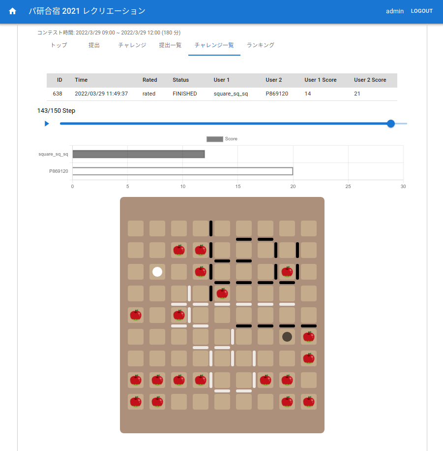

ランキング

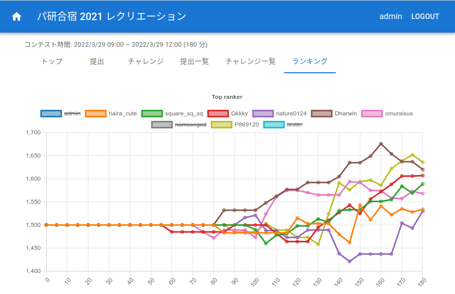

 

午後はまず square さんの「ランダムを楽しもう！」の講義から始まりました。分枝限定法で圧倒的に状態数を削減出来るのは驚きました。
数当てゲームで溜めてからの Wrong Answer（迫真）はかなり面白かったですね。

それはそうと、たまにレクリエーションのページを見に行くと講義中にレクやってる人がそこそこいたのは良くないと思いました...。

 

そしていよいよパ研合宿最大の行事であるパ研杯 2021 が始まりました。ギリギリで準備終わって良かったですね。

私が担当したのは F 問題（ワープ）でした。JOI 難易度 10.5 くらいのつもりで出しました。実装は重めですね。

部分点は割と優しくしたつもりだったんですが、時間がなかったのと、他の問題の部分点の方がコスパが良かったのとで小課題 2 以降は取っている人がオンサイトでは満点取った人以外いませんでした（QCFium 法除く）。悲しい・・・

結局 800 点が tatyam さんと noimi さん、320 点（QCFium 法）が一人と、20 点がその他大勢という感じでした。
あと、マラソンで今年も最適解が求まっていました。Writer 陣にマラソン出来る人がいないのにマラソン出すのが良くないんでしょうね。

あれ、スピラン、Freedom、レク、パ研杯全てでジャッジハック的な事が起きてませんか...？ Paken CTF でも鯖の root 取られてたし、多分パ研は呪われています。

 

適当に解説をして Death Game ですが、コンテスト以上に運営が †Death Game† になっていて、えぇ...。
私はああいうのも見ていて面白いので（最悪）好きですが、人によっては不快かもですね。

Round1, Round2 共にギリギリで通過出来ましたが、Round3 は解けませんでした。
双子が強いという事が分かりました。いかがでしたか？

コンテストは楽しかったです。

 

最終日は LT 以外作業がないので、部屋に戻ってからは†交流†を楽しみました。内容は Day1 でも書いた通り公開しません！笑

本当は LT のスライドを作ろうと思っていたんですが、交流が楽しいのでもういっかって事でスライドなし LT にチャレンジする事にして寝ました。

## 3/30

いよいよ最終日、、、　あれ？起きたら 8:45！
同室はオリバー含め全員寝ています。他の運営も多い 211 もぐっすり。あああああああ（発狂）

その後もなんやかんやあって、開始が大幅に遅れて 9:45 になってしまいました。tatyam さんみたいな聖人に迷惑を掛けてしまい本当に申し訳なかったです。マジでごめんなさい...。

講義では木のテクニックを扱っていました。重心分解は難しかったですが、それ以外は JOI で慣れていたのでかなり実家でした。

ちなみに Marp というツールでスライドを作っているらしいです。知見！

 

講義の後は LT をしました。
レクのオンラインジャッジの事を話すのは決めていたものの何を話すかは決めていなかったので正直焦っていましたが、普段通りに話していたら意外と上手く行けました。

スライドなし LT の技術の向上を実感します（あまり嬉しくはない）。これってコミュ力に含まれるんですかね？いや、大体一方的に喋ってるだけだからそうでもないか。

開始が遅れた関係で 1 時間程終了が遅れてしまいましたが、無事に終わって良かったです。
お菓子の分配を決めていなかったので閉会式では「自分の順位を弁えてお菓子を取っていって下さい」って事になりました。人柄が垣間見えて面白かったです。
余ったお菓子は運営が貰いました。わーい

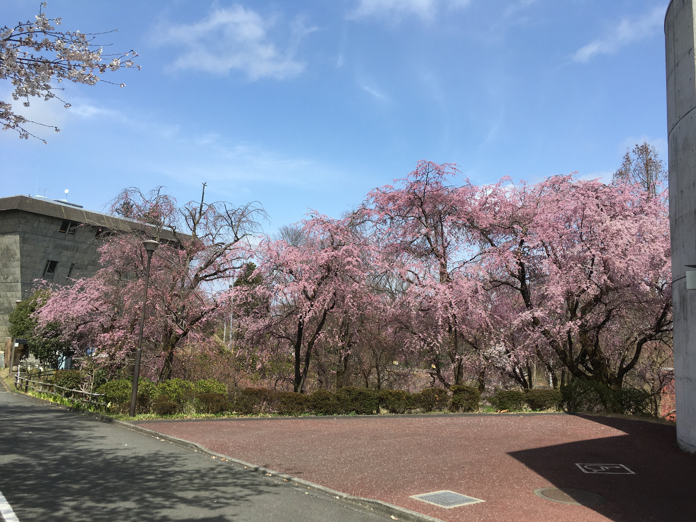

セミナーハウスに別れを告げた後、サイゼリヤで昼食を取りました。サイゼで喜ぶ PCT を撮ろうとしたんですが、逆光であまり上手く撮れませんでした。明るさとコントラストを調整してなんとかこれくらい。

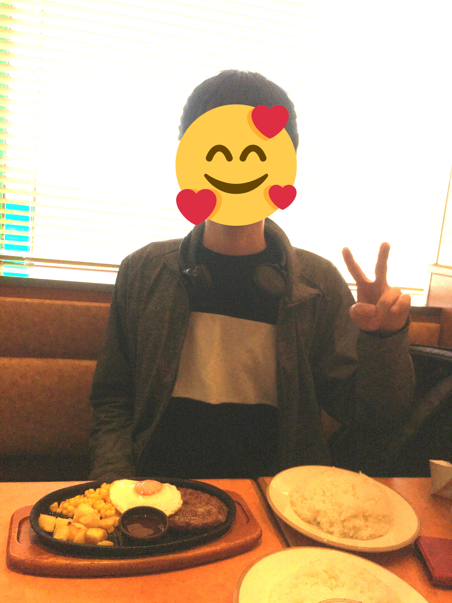

サイゼを出た後は中央線で取り敢えず新宿に向かいました。途中で tatyam さん達や kichi さん達に合流してびっくり。
kichi さんに会ったの、2 年前にボウリング行った時以来...？

 

新宿からはボウリング勢と音ゲー勢に分かれました。私は音ゲーについていく事に。ウニをやったのは 7 月末以来ですね。
楽しかったのでカードも作ってしまいました。それ含めて 1000 円くらいは溶かした気がします。

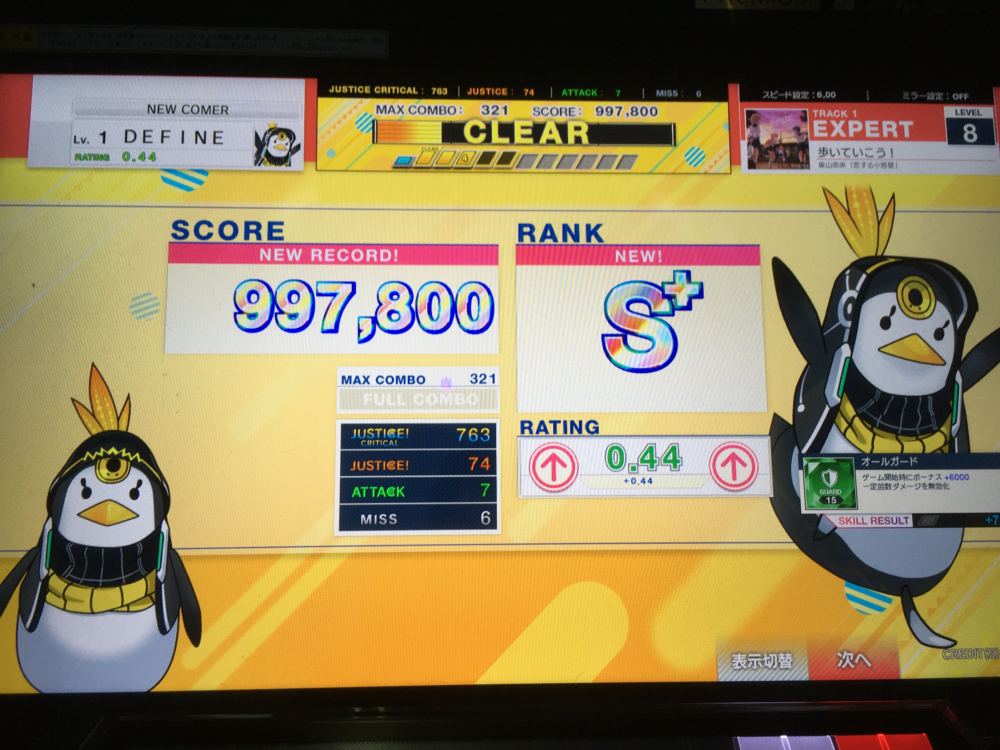

いつの間にか夜遅くなってしまったので、tatyam さんと Ryoga さんと haira さんと夕食に行きました。
近くのびっくりドンキーに入りましたが、なんだかんだで入るのは初めてかも。

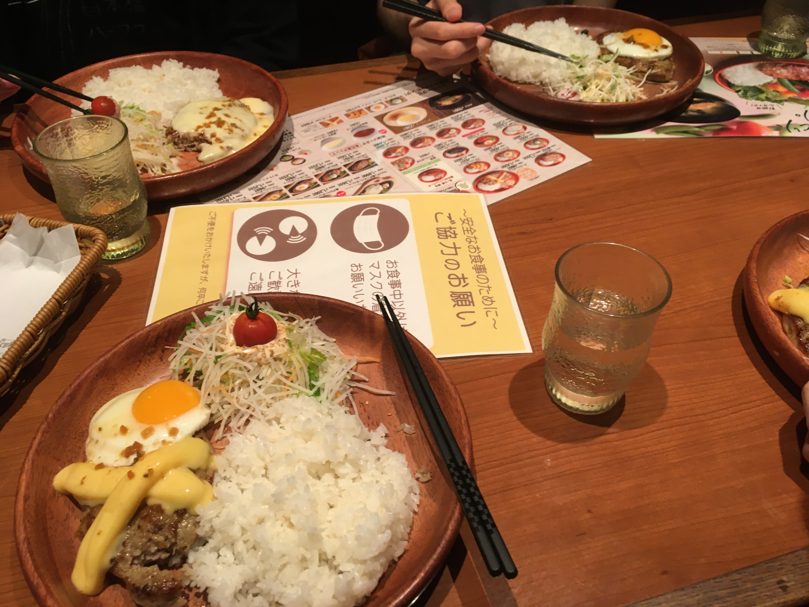

久しぶりに健全な会話をした気がします。最悪部屋さん...。いや、そうでもないですね。
私は一番食べるのが遅かったんですが、そんなに遅いかなぁ、他が早いだけじゃない？（言い訳）

会計の時に伝票を見ようとしたら tatyam さんが何も言わずに先に行って奢ってくれました。カッコ良すぎ。一生付いていきます。
本当に競プロ界隈の良心なんですよね、うん。どう育ったらこんなに性格が良くなれるのか知りたいです。

ちょこちょこ最悪ツイートにふぁぼってるのを観測する時は確信が揺らいだりしますが...。実際どんな気持ちで見ているんでしょうね、是非教えてほしいです。
そんな訳はないけど、裏で JOIG 勢誑かしてたら全てが信じられなくなりそう。

 

解散した後は kichi さんと御茶ノ水まで帰りました。レクのオンラインジャッジで cafecoder をちょっと参考にしたのでその話をしたりしました。

結局帰ったのは 22 時くらいになりました。帰った後は割とすぐに寝てしまった気がします。いやー高 2 になりたくない。

## おわりに

運営記のつもりが、まとまりのない参加記みたいになってしまいましたね。冒頭の文はなんだったんだ...。

本当に宿泊できるか怪しい状態から無事に終了まで持ってこれたのは感動しました。みんな言ってますが、オリバーの功労は凄いです。

Day2 ~ Day3 の夜にぺんぎんが死ぬ気で作業しながら「俺が犠牲になってパ研合宿が成功するならそれが本望や」と言ってオリバーと謎の絆が生まれていたのはちょっと面白かったですが、運営の真髄がその一言に詰まっていたように思います。まぁそうなる前に計画的に作業するべきだったんですけどね！

来年も宿泊開催出来る事を願っています。あと、大学生の招待枠がいくつかあったら嬉しいですね。

 

それでは最後に。パ研合宿最高！