## 1. 概要

8/10-15 にセキュリティキャンプ 2026 開発 Y4 **CDN 自作ゼミ** に参加してきました！本ゼミは，

1. CDN の仕組みを理解し，
2. その要素技術を自ら実装，
3. 物理的ミニ CDN を構築・動作させる事に成功

することで，**「私は CDN を自作した」と堂々と主張する権利** を獲得するゼミです．

- 講師: <a href="https://x.com/nyaxt" target="_blank">nyaxt</a> 先生
- チューター: <a href="https://x.com/kota_yata" target="_blank">kota-yata</a> さん
- 受講生: <a href="https://x.com/MSprzk" target="_blank">Miyamoto</a> さん, <a href="https://x.com/KwhrRyosei5590" target="_blank">かわはら</a>
さん, <a href="https://x.com/repunit11" target="_blank">レプ</a>さん, <a href="https://x.com/ret2home" target="_blank">ret2home</a> (私)

もう少し具体的に言うと，キャンプまでの事前学習で L4 Load Balancer や Cache Server などのソフトウェアを実装した上で，当日に配布される大量のネットワーク機器やミニ PC, Global IP らを用いて実際に CDN を構築します．

**LAN ケーブルやら光ファイバーやらがごちゃごちゃ x 4 人分**なので机上が本当に大変なことに... ※写真は私の分です

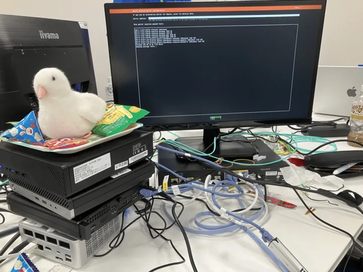

私はゼミのベースラインの内容に加えて，動画などの **大容量ファイルの高スループット配信** を行うため，**Request Collapsing** や **HTTP Range Requests** などを実装しました．

<a href="https://github.com/ret2home/ncdn" target="_blank">リポジトリはこちら</a>

当日は 1Gbps が上限となる構成でミニ CDN を動作させた後，ネットワーク構成を大きく変え，**ほぼ WireSpeed となる 3.3Gbps での配信に成功**しました！

この記事では，[応募課題晒し](/blog/others/seccamp2026_problem/) の反省も踏まえて，前半を読み物として楽しめる当日の参加記として，後半で技術的なトピックを扱います．また，個人的に他の人の参加記で自分の名前が出ていると嬉しいので，参加者の方々のエピソードを積極的に出しています．

## 2. 当日の日記

### 2.1. Day1: こんにちは，LINK FOREST

計画性がないので当日朝に ACCEA で名刺を受け取りつつ，12:16 京王多摩センター着．学科同期の <a href="https://x.com/atree4728" target="_blank">atree</a> と待ち合わせ，なんと多摩までお見送りに来てくれていた彼女(本当にありがとう)と 3 人で昼食を取りました．隙あらば彼に惚気ていた話を暴露されたりしました．

時間は余裕だったはずなのに，例によって計画性がないので走って何とか LINK FOREST に到着．
キャリーケースだからと，どうせ使わない学科 PC やらマスタリング TCP/IP 応用編やらを詰め込んだ昨日の自分と，多摩の起伏の多い地形を呪いました．

会場に着いた後は，セキュキャン初の名刺交換を楽しんだり，隣の席になった TEE ゼミのつよつよ <a href="https://x.com/no2cax" target="_blank">nonica</a> さんとちょっと意気投合(?)したりしていました．彼は凄くて，Rust で <a href="https://www.sigbus.info/compilerbook" target="_blank">rui さんの Compiler Book</a> を実装していたり，<a href="https://gihyo.jp/book/2025/978-4-297-15012-9" target="_blank">作って理解する仮想化技術</a> を Raspi 上で動かしたりとアクティブな人で，同年代なこともあり，かなり刺激を受けました．この compiler book ですが，同じゼミのレプさんも <a href="https://repunit11.com/blogs/2026-03-22-c-compiler-in-go/" target="_blank">Go で実装していて</a>，私もこの夏に何かしらの言語で実装したいです．

交流会では，筑波勢が多くて羨ましくなりました．慶應勢も多いですね．隣の席の彼もそうですし，うちのゼミのチューターも，CPU ゼミのガチプロと名高い <a href="https://x.com/Latte72R" target="_blank">Latte くん</a> も．**悲しくなったので，附属高校のよしみで筑波の顔をしておきました**．

Miro ボードに意気込みを書くパートがあったのですが，PC をホテルの部屋に忘れたのでスマホで書くしかなく，爆速 CDNとだけ書いたら 

**「おっ，爆速 CDN を作るらしいですよ！成果発表に期待しましょうね😎」** 

と壇上で読み上げられ，以来爆速 CDN がゼミでミーム(?)になりました．

21 時頃に解散後は，LT 会が Day2 ということで，atree と一緒にネタを考え，就寝．

### 2.2. Day2: はじめての物理ネットワーク，LT 大会

専門講義会場に入ると，**机の上には生のインターネットが来ていました**．CDN ゼミは NOC 様様のおかげで，他の会場ネットワークと隔離された unfiltered なネットワークが提供されています．NOC 部屋から光ファイバーが廊下を伝って，机の上の 10G L2 スイッチまで来ているという訳です．

当日はここら辺を何も分かっていなかったので，揃って NOC 部屋を見学させていただきました．けしからんネットワーク遊びの話をして下さった時の楽しそうな顔が今も思い浮かびますね．Home NOC やりたいなぁ，**目指せ逸般の誤家庭**．NOC の皆さん，ありがとうございました！

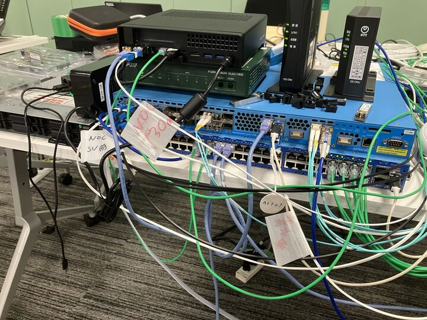

部屋に戻った後は，初めての Router 設定をしました．このゼミでは受講生それぞれに Private ASN と global 割当 prefix が与えられており，インターネット相手に通信を往復するには，BGP プロトコルを用いて自分の持っているアドレスを広告する必要があります．これを間違えて他のサービスの IP を広告したりすると，BGP ハイジャックが起きて **インターネットが壊れます**．

<iframe width="318" height="212.25" scrolling="no" src="https://alu.jp/series/%E3%81%8B%E3%81%90%E3%82%84%E6%A7%98%E3%81%AF%E5%91%8A%E3%82%89%E3%81%9B%E3%81%9F%E3%81%84%E3%80%9C%E5%A4%A9%E6%89%8D%E3%81%9F%E3%81%A1%E3%81%AE%E6%81%8B%E6%84%9B%E9%A0%AD%E8%84%B3%E6%88%A6%E3%80%9C/crop/embed/Cjj7qWXNOuksiT6getUk/0?referer=oembed" style="margin: auto; display: block; border-width: 0px;"></iframe>

諸々の設定が完了し，**11:30 頃にインターネットに進出成功**．

<hr/>

昼食後は各々に Minisforum などのミニ PC が配布され，事前学習で制作した Load Balancer などのソフトウェアを動かしていくフェーズとなりました．

写真はまだ PC 1 台ですが，これがどんどん Cache Server に Origin Server に増えていくことになります．

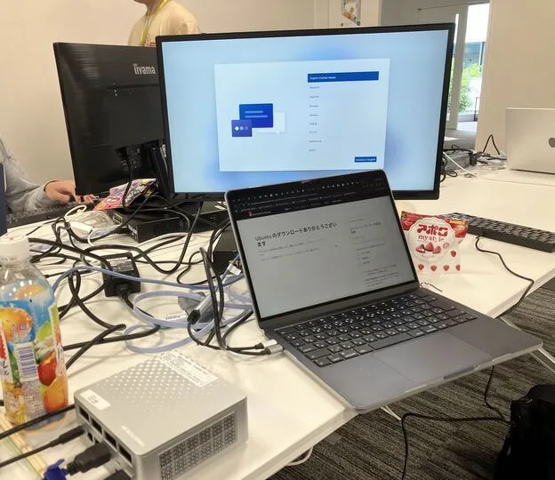

仮想マシンはともかく，実機に Ubuntu を入れるのは久しぶりで手間取ってしまいました．間違えて **GUI 付きの Ubuntu Desktop の方をインストール**してしまったり，**BIOS をマウスで操作**して笑われたり etc...

ちなみに PC にはデフォルトで Windows が入っているので，起動時に Del なりを連打して BIOS の画面を出す必要があるんですが，最初は大概失敗して「絶望の画面」が表示されることになります．そもそも PC によって連打するキーも違いますし... **中でも最悪だったのは，Windows Update が始まったこと**ですね．

何とか Windows に打ち勝った後は，いよいよソフトウェアをデプロイしていきます．事前学習環境では network namespace で分離し，一つの設定スクリプトになっていましたが，本番環境ではそれを L4LB 用，Cache Server 用，Origin Server 用，... とやっていく必要があります．微妙な差が多いので注意力が必要です．

そんな中 Miyamoto さんが 17:30 頃に接続に成功し，一人目の免状交付となりました！私の方は LAN 内から直 IP では動作したものの，VIP 経由での動作までは漕ぎ着けませんでした．

<hr/>

夕食後は LT 大会ということで，atree と **【内部告発】東大システムプログラミング実験の実態** と題して，弊学科のポジティブキャンペーンをしていました．2 人で LT をするので枠を 10 分くださいと言っていたのに，蓋を開けたら 5 分しか貰えませんでした（涙）．

余談ですが，atree は周りの受講生から **内部告発とか大丈夫ですか？**と割と心配されたらしいです．

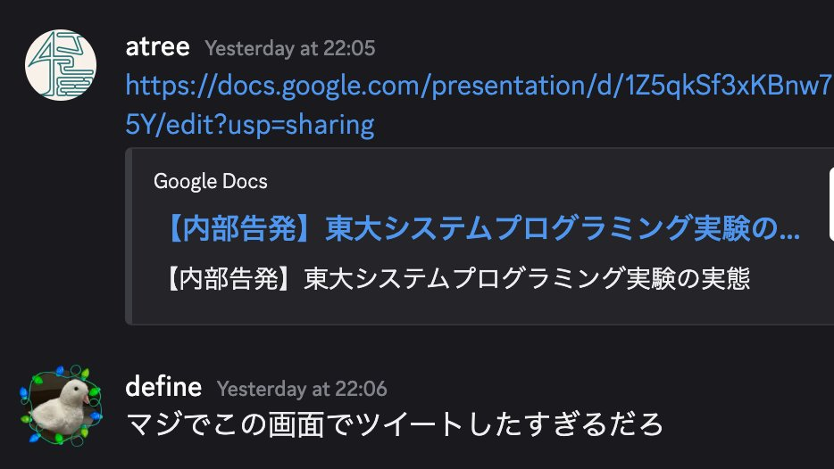

??? "LT 大会で特に面白いと思った発表の紹介"
    最初は hikalium 先生の部屋にいたのですが，トップバッターの OS 自作ゼミチューターの <a href="https://x.com/petitstb" target="_blank">バトルプログラマー見習いいちご</a> さんの発表が最高でした．何やら発表が中々始まらないと思ったら，自作 OS からスライドを映して発表していました（驚愕　しかも動画まで流れていました（驚愕２　OS ゼミは CDN ゼミのお隣なので様子をよく眺めていたのですが，チューターなのか受講生なのか分からないくらいに開発を楽しまれていたのが印象的でした．

    続いて，同じく OS ゼミ受講生の <a href="https://x.com/temari1013" target="_blank">てまり</a> さんの発表も面白かったです．hikalium 先生の Wasabi OS の拡張として MinixFS を触っていたらエンディアンの問題に直面し，調べたらそもそものファイルシステムのバグを見つけてしまった，という話でした（間違ってたらごめんなさい）． うちのシスプロ実験で遊んだ教育用 OS pintos のファイルシステムパートを飛ばしてしまったので，この夏にまたやりたくなりました．

    一番笑ったのは CPU ゼミ受講生の <a href="https://x.com/Ryoga_exe" target="_blank">Ryoga</a> さんの，筑波大で行われているけしからん電話機のイタズラの話でした．やはり登先生の本拠地，筑波は勢いがあります．そういえば NOC 部屋にも黒電話やら FAX やらが置かれていましたが，あれも筑波からの刺客，NOC チューターの <a href="https://x.com/bb_mase" target="_blank">間瀬bb</a> さんの仕業らしいですね．彼は :masebb_good: がミームになっていましたが，後日夢にも出てきました．恐るべし．

### 2.3. Day3: CDN 構築成功，そして...

Day2 中には動作しなかった私の CDN ですが，引数が事前演習用のままなことが判明し，朝一に修正しました．それでも CDN は動きません（大きなかぶ）．

奇妙なことに，VIP 経由でアクセスすると，**ほぼ 50% の確率でアクセスに失敗**．かなり沼りましたが，ようやく原因が判明しました．VIP 宛のルーティング先として /32 で L4LB のアドレスを追加していたのですが，同時に /32 で Null0 へも追加していたため，prefix length が同じになり，**Round Robin で 50% の確率で虚空に吸い込まれていた**ためでした．

それを修正し，11:00 頃についに動作成功！！ HTTP Range Requests の実装もしていたので，**動画配信にも成功**しました！

ちなみに配信している動画は <a href="https://opencontent.netflix.com/" target="_blank">Netflix Open Content</a> の Sol Levante という作品です．4K HDR で mp4 にしても 1G 近いファイルサイズです．

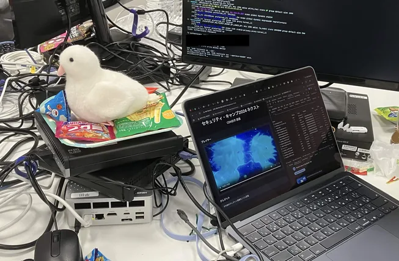

というわけで，**「私は CDN を自作した」と堂々と主張する権利** ゲット！

つい「私は CDN を自作したぞ〜〜」と叫んでしまいました．周りのゼミの方もお祝いしてくれて嬉しかったです．

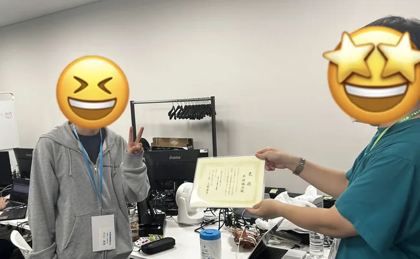

ところで，私はこんな感じの **Realtime Visualizer を実装**していました．動画ファイル配信時に，各リクエストについて，ファイルの一部分である **chunk ごとにキャッシュの状況が分かります**．

緑が HIT, 黄色が COLLAPSED (MISS だが，IN FLIGHT な fetch があるので待つ)，赤が MISS となっています．ブラウザの Developer Tool よろしく，リクエストごとのタイムラインやスループットも見られるので，配信のボトルネックも分かるという訳です！　動画は事前演習環境の時のもので，ストレージ内(しかも tmpfs) の配信なので，キャッシュが温まると **なんと 20Gbps 近く**出ています．

これカッコ良くないですか？？ (UI は AI に組んでもらいました)

<video controls>
  <source src="./visualizer.mp4" type="video/mp4" />
</video>

実機で負荷を掛けながら，画面でスループットを見ると **860Mbps ほど出ている** ことが分かりました．Router の性能的に 1Gbps が上限なので，それに引っ掛かっている感じです．

免状を頂き，残りは何をしても良いので，まずは折角実装した IPv6 対応をしたり，まだ実質 Load Balance していないので Cache Server を増やしたりしようかと思っていました．本音は，苦労してやっと CDN を組み上げたのに，スループットを出すためにネットワークを一からまた組み直すのは大変過ぎる...という及び腰だったと思います．

それを見抜かれたのか，講師の nyaxt 先生に「君はスループットを出したいんでしょ？そしたらまず組み直した方がいいんじゃない？」とご指導頂き，**無事に組み直しが決定**しました．

<hr />

現状は Cisco C891FJ-K9 Router に L4LB, Cache, Origin 用のミニ PC を繋いでいて，Router がその上の 2.5G L2 スイッチに繋がっている構成だったのですが，それを以下のような構成に組み直すことになりました．（レイヤーが混ざっていてあまり良くない図）

簡単に言うと，**新しく支給された 10G SFP+ ポート付きのミニ PC を Router 兼 L4LB** として使い，PC 群はこれも新しく支給された 10G L2 スイッチに接続する構成にしました．このミニ PC が高性能品で，なんと 64GB RAM を積んでいます．

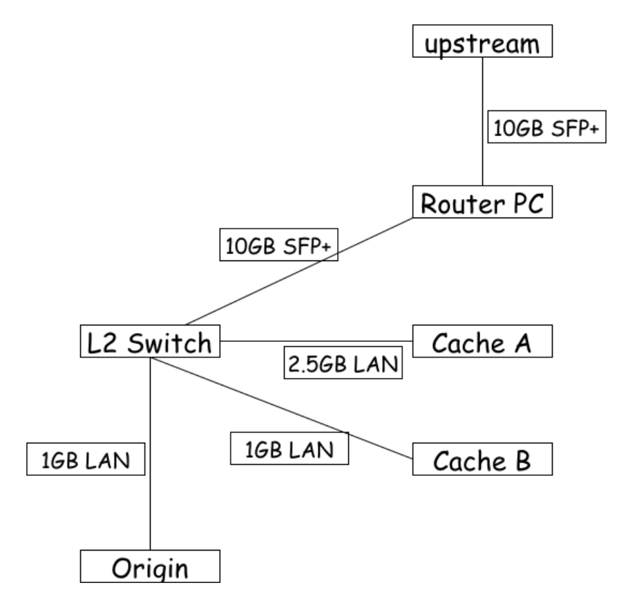

記事のトップ画像は，この新しいミニ PC に Ubuntu Server をインストールしている所でした．これで 4 台目になり，段々映えてきましたね．


ミニ PC 群へは SSH 経由で作業していたんですが，新しく global 割当 prefix を頂いたので，ネットワークを切り替える作業が必要で，**失敗すると SSH が繋がらなくなり**，キーボードやディスプレイを繋いで直接作業することになるのが大変でした．また，PC 名を前の構成の前提で付けていたので，役割を変えると **名前が実態と違ったり，以前のスクリプトが入っていたり** と混乱しました．そして，当然ですが PC の台数が増えると **SSH 窓も増え** ...

という訳で爆散し，残りは翌日へ．

夕食では，<a href="https://diary.shift-js.info/building-a-riscv-cpu-for-linux/" target="_blank">Linux が動作する RISC-V CPU を自作した (2019 年度 CPU 実験 余興)</a> で有名な，専門 C プロデューサの <a href="https://x.com/lmt_swallow" target="_blank">米内 貴志</a> さんとお話でき，大変光栄でした．学科の控室「地下」が理学部 7 号館建て壊しで「地上」になったお話をしたら大変驚かれていました．理情昔話にちょっと詳しくなりました．

### 2.4. Day4: ありがとう CDN 自作ゼミ

セキュリティキャンプは 10-15 で 6 日間ありますが，実は専門講義は 3 日間しかありません．しかも，この日の午後は発表と片付けなので，実質午前中が最後．

諸々の設定を済ませ，**LAN 内からはアクセス出来るようになりましたが，インターネットから接続出来ません**．BGP 広告する方法ではなく，NOC 側 Router から static route を貰っているので，BGP ミスという訳ではありません．それに，外への ping も通っています．

??? note "原因の詳しい解説"
    nyaxt 先生に相談して，**原因は L4LB と Router を同じ PC にしたため**であることが判明しました．これを理解するには，XDP について説明する必要があります．L4LB では ingress hook 手法である XDP を使っているのですが，attach されている interface が問題なのです．以前は L4LB 用の PC があり，LAN 側 interface からパケットが Linux に渡される前に処理を挟み，同じ interface から送り返していました．

    現在も L4LB 兼 Router PC の LAN 側 interface に attach しており，LAN 側からのアクセスでは同じように動きます．しかし，WAN 側 interface から来たパケットは Linux stack を通ってから LAN 側 interface へ出ます．これは LAN 側 interface への ingress 方向のパケットではないため，処理できません．

    解決方法として，L4LB 兼 Router PC を network namespace で分離し，WAN 側 interface から入って来たパケットが一旦 L2 スイッチを通り，L4LB namespace の interface に戻ってくる方式を提案されました．これで，WAN 側からのパケットも ingress 方向のパケットとして扱えるようになります．

これに気付いたのがお昼休み直前だったので，昼食を取って，コース内発表のためのスライド制作をして，15:30 までの残りの 1.5h ほどで作業をする羽目に...

例によって，また細かい設定の変更が必要となり，tcpdump と睨めっこしながらのデバッグをする羽目になりましたが，**なんと 15:28 に動作成功！！**
この変更のために内部からも動かなくなり，ほとんど諦めかけていたので，本当に嬉しかったです．最後のバグは，L4LB namespace 分離で IP を新しくした変更が Server の設定スクリプトに反映されていなかったことでした．

発表の休憩時間に試しに負荷を掛けてみると，**なんと安定して Client 3.27 Gbps, Origin 928Mbps** 出ています！Cache Server への LAN の帯域が 2.5G, 1G で合計 3.5G であり，Origin への容量が 1G であることを踏まえると，**ほぼ Wirespeed** では？？

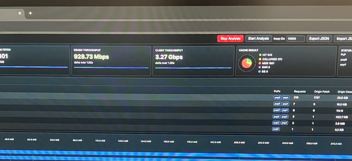

これはびっくり，ということで私の成果発表の最後に続報として報告すると，ゼミ内部からも驚きの声が．それもそのはず，さっき分かったんだもん．

ここまでは当日のネットワークの工夫の話をしていますが，その前段のソフトウェアでの高速化については，[4.2. 事前学習2: PoP 演習](#42-2-pop) を参照してください．

何はともあれ，Day1 に掲げた目標 **「爆速 CDN」**を概ね？達成することが出来て良かったです．発表後のポスターセッションでは，協賛企業の方が Wirespeed 達成後のさらなる工夫についてアドバイスをしてくださいました．

17:00 以降は片付け，私は全体発表のスライド制作をしました．あんなにケーブルでぐちゃぐちゃだった机の上も気付けば片付いていて，文化祭の片付け後のような寂しさを覚えました．本当はやりたかったが，時間がなく出来なかった事が多いのもそんな所です．IPv6 対応，複数 L4LB，ライブ配信，Raspi 触ってみる...

### 2.5. Day5: ありがとうセキュリティ・キャンプ協議会

午前中は全体成果発表会で，私は Y4 CDN ゼミの発表を担当しました．2 分の時間ギリギリでしたが，Y コースプロデューサ hikalium 先生の笑顔から見て，セーフだったと思います．

特に印象に残っているのは CPU ゼミとジュニア，そして NOC ですね．CPU ゼミはなんと，FPGA からスライドを映していました．LT 大会では自作 OS から映していましたが，今度は FPGA から...！そして，ジュニアコースの発表が本当にハイレベルで，良い意味で耳を疑いました．自作 OS やってる人もいたし，日本の未来が明るすぎる！私の一つ上の代には，2019 年に中学生で自作言語を発表して「スーパー中学生」と称された人がいるんですが，その人を彷彿としました．

発表後に席を外してから戻ったら，発表への質問をするために私を探していた方々がいらっしゃって中々嬉しかったですね．

閉会式後の昼食では，<a href="https://x.com/uchan_nos" target="_blank">uchan_nos</a> さんとお会いできました．実は中学生の時に <a href="https://book.mynavi.jp/ec/products/detail/id=121220" target="_blank">ゼロからのOS自作入門</a>の出版前試読に参加し，名前まで載せていただいたのですが，まだ未完なのでこの夏こそ完遂します！と宣言して来ました．頑張るぞ〜

昼食後の協賛企業イベントについては，多くは書けませんが最高でした．協議会の皆様，協賛企業の皆様ありがとうございました．

### 2.6. Day6: ありがとう LINK FOREST

私のアイコンでもある，鳩のぬいぐるみ「あひるくん」(命名: Latte くん) を大変気に入ってくださった方がいたので，写真を撮ってから解散しました．<a href="https://note.com/unicorn_lovers/n/nf29dff04c7d6" target="_blank">参加記</a> にも載せてくださったようです．

解散後に秋葉原に繰り出す人たちもいて，体力が凄いなぁと思いながら atree らと帰りました．帰りは <a href="https://x.com/h_okumura/status/1436869174664458244" target="_blank">日本語 CS 用語集</a> を使ってクイズをしていました．


意外と，内部の仕組みを分かっていれば答えられるものも多く面白かったので，大体難易度順（？）にいくつか英訳問題を出しておきます．いくつわかりましたか？

例: 返戻値 -> return value

!!! question "問題"
    1. 緩衝領域
    2. 奇偶検査
    3. 重つなぎ並び
    4. 操作系
    5. 信号燈
    6. 直訳

??? note "解答"
    1. buffer
    2. parity check
    3. doubly linked list
    4. operating system
    5. semaphore
    6. assemble


## 3. 全体的な感想・反省

一週間経過して振り返ってみると，やはり**飛び込んでみて良かった**というのが第一です．Twitter 上での技術交流だけでは得られない刺激がそこにはあります．
また，B3 のこの時期に参加して丁度良かったと思います．というのも，専門講義が始まり CPU，OS，コンパイラ等 CS の各分野の知見が付いてきて，他の開発コースの参加者とも，その内容について(多少は)踏み込んだ話をする事が出来るからです．

その上で，共通講義を踏まえて，離散数学や情報論理のような**基礎理論よりの講義にもっと力を入れよう**と思いました．既存ツールの使い方を学んだ先にある，根本的な改善に必要なのは基礎的なサイエンスです．簡単な例で言えば，CIDR の仕組みを理解し，Go の net/netip ライブラリの使い方を分かった所で，より根本的に longest prefix match を見つけるのに必要なのは，データ構造とアルゴリズムの知見です．また，基礎的な数学の知見が足りていないために，気になる分野に踏み込めないということも往々にしてあります．

ここからは主に CDN ゼミ本体に関する反省ですが，事前学習期間に強調されたこととして，**トレードオフ**を意識する重要性です．ソフトウェアエンジニアリングは本質的にはトレードオフの選択であり，考えられる各手法のトレードオフは何か，その中でなぜその手法を選択したかを説明できるようになる必要があるということです．

言葉だけ聞くと，まぁ意識すればいいよねという話になりそうですが，考えるほどに難しく感じられました．
Load Balance の例で言えば，特に意外だったのが「**CDN ではサーバの負荷は下げれば下げるほど良いとは限らない**」ことです．CDN はキャッシュを扱っている以上，負荷がある程度掛かっている方が，キャッシュヒット率が高い場合もあるのです．

この例を見るに，対象となる**指標を考える難しさ**を実感できます．今回で言えば，負荷が低い → キャッシュヒット率が低い → Latency 増加という関係に思い至らず，そもそも指標としてキャッシュヒット率を考えられませんでした．さらに，トレードオフを設計できた所で，何らかの考えで割り切って選択をする必要がありますが，これはユーザに**どんな価値を提供するか？**という上位の設計判断となり，局所的・大局的両面の難しさが感じられます．

もう一つは，特に当日の**問題の切り分け** についてです．私は問題が起きた際に，問題の切り分けをかなり適当に行っていた節があったと思います．本来はどこまでが正常に作動しているのかを記録しながら調査し，仮説を立てて検証していくのが筋です．しかし，私は怪しそうな所を調べ，それが原因だったら直し，違ったら他の原因を考えるのを繰り返し，最終的に動いたらそれでよしとすることが多かったです．その結果，**自分が何のトラブルに対応しているのか，どこまでが正しいのかが何も分からなく**なり，ますます困ってしまいました．最終日になっても tcpdump と仲良くなれていなかったのは，自分でもどうかと思いました．
トラブル対応においては，これまでの調査，そこから導き出した仮説，結果というサイクルを入念に記録し，**少なくとも自分に向かって説明出来なければなりません**．

これらはいずれも，サイエンス及びエンジニアリングにおける基礎的な事柄ですが，自分に根本的に足りない部分であると実感する所となりました．これらを意識して演習出来る機会はそう多くないので，これからの講義・実験で特に気を付けたいです．

最後に，このような機会を設けてくださった講師の nyaxt 先生，チューターの kota-yata さん，そして一緒に頑張った受講生同期の皆さん，他コースの講師ほか，セキュリティ・キャンプ関係者の皆様にお礼申し上げます．

## 4. おまけ: 事前学習まで

技術的に細かい話を書いていきます．

### 4.1. 事前学習1: GSLB 演習

CDN の要素技術に触れようということで，まずは GSLB (Global Server Load Balancing) を実装する演習が行われました．これは，ユーザを適切に近傍の PoP (Point of Presence) と呼ばれる拠点に誘導することで，**Latency を削減するとともに，特定の PoP に負荷が掛かりすぎないようにする** 仕組みです．

??? note "GSLB の詳しい解説"

    方法としては大きく 2 つあります．

    一つは **DNS を用いる方法**で，ECS (EDNS Client Subnet) と呼ばれる，クエリに Client IP Subnet を載せる拡張を用いることで，Client によって返す IP を変える手法です．各サーバの負荷状況を見て自由度高く制御することが出来る一方で，DNS の結果がキャッシュされると，障害発生時に切り替えが遅れる欠点があります．

    もう一つは **BGP Anycast を用いる方法**で，同一の IP を複数 PoP に割り当てた上で，それぞれから BGP 広告すると，経路制御の結果，各 Client から(多分)近い PoP に到達するという手法です．地理的位置ではなく，インターネット上の最適経路上に誘導するため，Latency が削減され，障害時も高速に切り替えられる一方で，誘導先は経路制御に任せるため自由度が低い欠点があります．

    参考: <a href="https://shinobi.hatenadiary.com/entry/2026/05/08/101131" target="_blank">https://shinobi.hatenadiary.com/entry/2026/05/08/101131</a>

演習では DNS を用いる方法について，Client IP Subnet が与えられた時に，どの PoP に誘導するか選択するアルゴリズムの実装を行いました．

Visualizer も提供されていて，PoP や Probe の場所が表示されます．かっこいい！

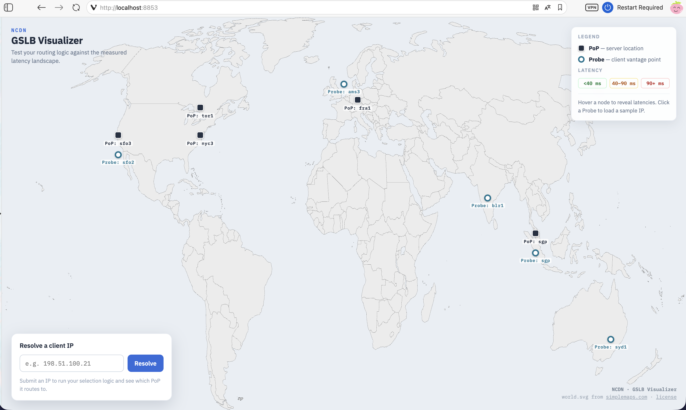
(Miyamoto さんの Discord 上投稿より)

私は大まかには **Geo IP** を用いて Client の国を推定して，そこから最も近い PoP を選択するという方式にしました．国の推定は，<a href="https://github.com/ipverse/country-ip-blocks/" target="_blank">country-ip-blocks</a> というリポジトリで国ごとの CIDR List が得られるので，**CIDR Trie** を構築すると Longest Match で出来ます．<a href="https://github.com/ret2home/ncdn/pull/1" target="_blank">Pull Request</a> <br/> Probe Subnet 外の IP も近傍の PoP に誘導できるようになった一方で，推定粒度が国単位なので，国土が広い国だと精度が落ちることや，地政学的要因などにより，**地理的近傍は必ずしもネットワーク上の近傍とはならない**欠点がありました．

この演習の発表で強調されたことが，トレードオフについてであり，内容については反省に書いた通りです．
技術的な内容以上に，トレードオフについて考えさせられた演習でした．

### 4.2. 事前学習2: PoP 演習

本演習では，当日に動かすソフトウェアとして，L4LB (Load Balancer), Cache Server を実装しました．

L4LB では，サーバ数の増減によって，割り振り先のサーバが変わり TCP Connection が壊れないように，Consistent Hash や Connection Tracking を実装しました．

Consistent Hash には，均等な振り分け方法として知られる Maglev Hash や，実装が簡単な Rendezvous Hash が知られていますが，私は Rendezvous Hash を実装しました．ちなみに，同じゼミのかわはらさんは，<a href="https://blog.kawababa.com/writing/2026/0512/" target="_blank">なんと応募時点で Maglev Hash を実装</a> されていました．凄すぎますね．

L4LB の特に面白いポイントは，XDP と呼ばれる ingress hook 手法を用いて，**温もりのある手作り IPv4/v6 over IPv6 トンネリングヘッダ**を付けていたり，行きは L4LB を経由するのに帰りは Cache Server から直接 return したりする (DSR, Direct Server Return) する所だと思います．

```c
  ip2_v6->version = 6;
  ip2_v6->priority = 0;
  ip2_v6->flow_lbl[0] = 0;
  ip2_v6->flow_lbl[1] = 0;
  ip2_v6->flow_lbl[2] = 0;
  ip2_v6->payload_len = htons(inner_length);
  ip2_v6->nexthdr = (isv4 ? IPPROTO_IPIP : IPPROTO_IPV6);
  ip2_v6->hop_limit = 64;

  memcpy(&ip2_v6->saddr, &src_entry->ip_address_v6_byte, sizeof(struct in6_addr));
  memcpy(&ip2_v6->daddr, &dest->ip_address_v6_byte, sizeof(struct in6_addr));
```

Cache Server では，**SIEVE** と呼ばれる Cache Replacement，Cache Miss 時に大量に Origin Server に fetch しないようにする **Request Collapsing**，動画配信用に HTTP **Range Requests** などを実装しました．多分実装が一番大変だったのはコレです．というのも，Request Collapsing やら Cache やらで共有資源が多いので，適切に Lock を設計し，また Cache Object の生存期間を考える必要があるからです．

実装する中で特に実感したのは，**Producer/Consumer 分離**及び **Control/Data Plane 分離**の重要性です．Request Collapsing の実装を例に説明すると，最初はキャッシュミス時の Origin Fetch と Client Write を同じ関数で扱っていました．すると，その Origin Fetch を待って Collapsed したリクエストたちは，その結果を待って別途 Client Write する必要があります．同じ Client Write なのに，最初とそれ以降で処理が分かれているのは，あまり綺麗ではありません．

さらに，HTTP Cache Control を実装すると，stale-while-revalidate では，古いキャッシュで Client Write しつつ，background で Origin Fetch することになり，pure な fetch が必要になります．

という訳で，Origin Fetch (Producer) と Client Write (Consumer) を分離すると，次のような嬉しさがあります．

まず，**Consumer 側はキャッシュのヒット状況を意識する必要がない**ということです．キャッシュヒットしていようと，IN FLIGHT なリクエストを待とうと，Origin Fetch していようと，「Producer の結果を待つ」ということに抽象化できます．

また，Origin Fetch と同時に複数 Client でそれぞれの速度で書き込む実装が自然になります．結合している場合，最初の Client の書き込み速度が遅い場合，全体が遅れることになります．分離したことで，Producer は一定サイズ読み込む度に条件変数を broadcast し，Consumer はそれぞれの file pos を持ちながら，それぞれの速度で書き込む事ができます．これにより，**Origin から読むと同時に，並列に Client に書き込む事ができ，大容量ファイルにおいて特にスループットが大変向上**します．


### 4.3. さらにおまけ: 応募課題

CDN 自作ゼミの応募課題は，自己アピールを除くと去年と共通で，以下の 1 問のみでした．

> ブラウザのURLバーに、 https://www.shonenjump.com/j/weeklyshonenjump/ を入力して決定キーを押した時になにが起こるか」を調べて、可能な限り詳しく説明してください。

普通は教科書的な知識を前提として，Wireshark でパケットキャプチャして，DNS, TCP Handshake, TLS Handshake の後に HTTP が始まって，レンダリングされますね〜くらいの内容になると思います．私も最初そうなりました．

しかし，<a href="https://www.on-keyday.net/static/blog/posts/2025_07_15_seccamp_2025_y2_application/" target="_blank">去年の参加者の応募課題</a> を見ると，なんとブラウザの内部実装や OS の TCP プロトコルスタックまで潜り込んでいます．問題文には **可能な限り詳しく説明してください** とあります．全然不十分では？？

ということで，AI と壁打ちしつつ，パケット解析に加えて，L5-7 TLS, HTTP 処理の主体であるブラウザ，L4 TCP 処理をしている OS のコードを読み，L3 経路情報を見て...ということで大変なことになりました．

特に頑張ったのがブラウザ解析パートでした．講師の方が Chromium 開発者なので適当なこと書けないなということで，Enter キーを検知してから，DOMContentLoaded が発火するまでの**ブラウザ側処理の一連の流れを，関数レベルでなるべく繋ごう**と試みました．

Firefox Profiler を使うと Stack Trace が取れるので，<a href="https://searchfox.org/" target="_blank">Searchfox</a> でコードと突き合わせると，追うことが出来ます．

たとえば，以下で `_on_keydown` と見えているのが Enter キーの処理で...と言った具合です．かなり途方もないですね．

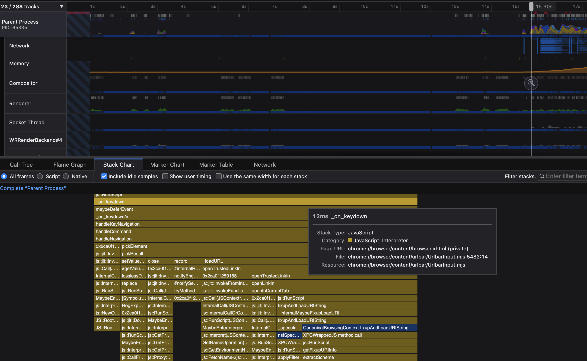

一回で取れるなら良いんですが，困ったことにサンプリングの都合で処理時間が短いものは表示されないことがあります．ということで，**表示されるまでガチャを回し続ける**という作業も発生し...

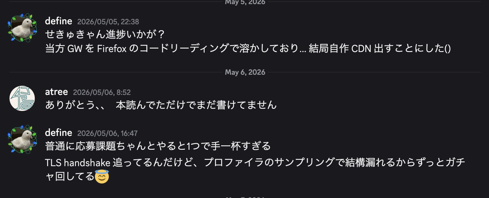

...という訳で，かなり頑張ったんですが，ゼミで必要となったのはどちらかと言うと L1 〜 L4 (特に L3) の知識でした（完）

提出内容の詳細は[応募課題晒し](/blog/others/seccamp2026_problem/)を参照してください．多分来年は分量制限が付けられる気がします．
